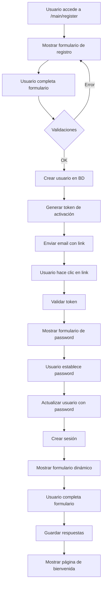
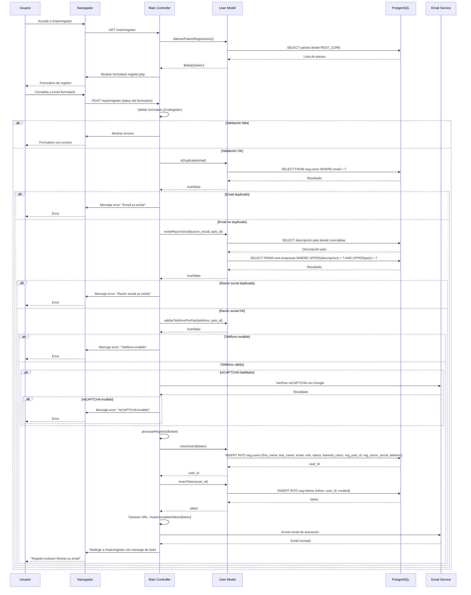
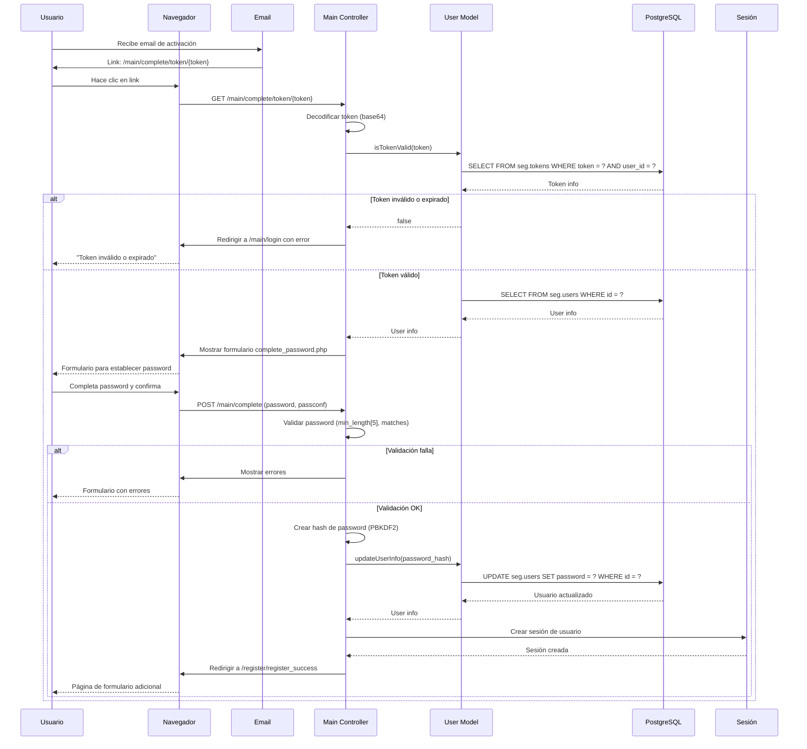
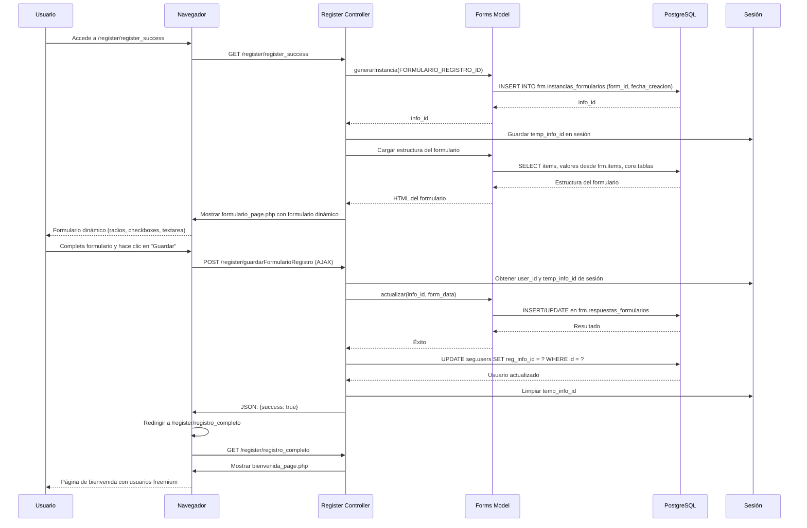
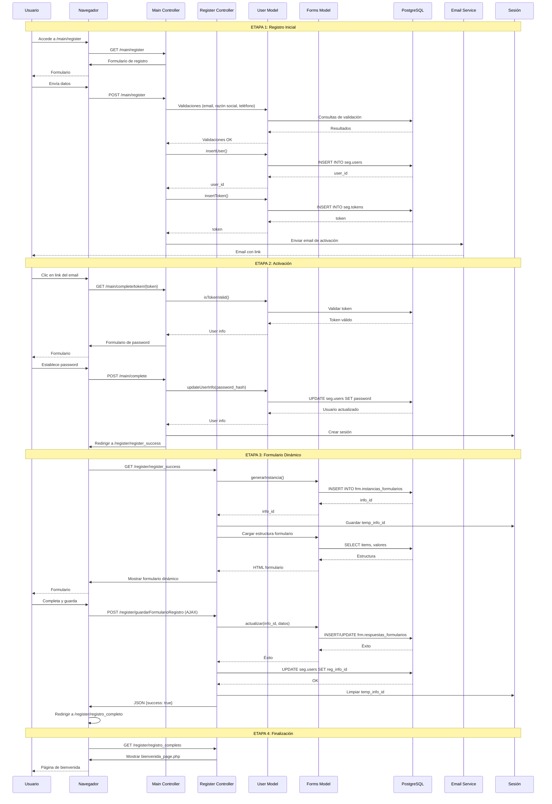

# Proceso de Registración de Usuario

Este documento describe el flujo completo del proceso de registración de usuarios en Trazalog Tools.

## Tabla de Contenidos

1. [Resumen Ejecutivo](#resumen-ejecutivo)
2. [Flujo General del Proceso](#flujo-general-del-proceso)
3. [Diagramas de Secuencia](#diagramas-de-secuencia)
4. [Detalles Técnicos](#detalles-técnicos)
5. [Validaciones](#validaciones)
6. [Base de Datos](#base-de-datos)

---

## Resumen Ejecutivo

El proceso de registración de usuarios en Trazalog Tools consta de **5 etapas principales**:

1. **Formulario de Registro Inicial**: Usuario completa datos básicos (nombre, email, razón social, teléfono, país)
2. **Validaciones**: Se validan duplicados, formato de teléfono y reCAPTCHA
3. **Creación de Usuario**: Se crea el usuario en la base de datos (sin password) y se genera token de activación
4. **Activación de Cuenta**: Usuario recibe email, establece su contraseña y activa la cuenta
5. **Formulario Adicional**: Usuario completa formulario dinámico con información adicional
6. **Finalización**: Usuario ve página de bienvenida con información de usuarios freemium

---

## Flujo General del Proceso



---

## Diagramas de Secuencia

### 1. Proceso de Registro Inicial



### 2. Proceso de Activación de Cuenta



### 3. Proceso de Formulario Dinámico



### 4. Flujo Completo Integrado



---

## Detalles Técnicos

### Controladores Involucrados

#### Main Controller (`application/controllers/Main.php`)

- **`register()`**: Maneja el formulario de registro inicial
  - Valida datos del formulario
  - Verifica duplicados (email, razón social)
  - Valida formato de teléfono según país
  - Verifica reCAPTCHA (si está habilitado)
  - Llama a `procesarRegistro()`

- **`procesarRegistro($clean)`**: Procesa el registro
  - Inserta usuario en `seg.users` (sin password)
  - Genera token de activación
  - Envía email con link de activación

- **`complete()`**: Maneja la activación de cuenta
  - Valida token
  - Muestra formulario para establecer password
  - Actualiza usuario con password hasheado
  - Crea sesión
  - Redirige a formulario adicional

#### Register Controller (`application/controllers/Register.php`)

- **`register_success()`**: Muestra formulario dinámico adicional
  - Crea instancia del formulario
  - Carga estructura del formulario
  - Muestra formulario al usuario

- **`guardarFormularioRegistro()`**: Guarda respuestas del formulario
  - Actualiza instancia del formulario
  - Guarda respuestas en `frm.respuestas_formularios`
  - Actualiza `reg_info_id` en `seg.users`

- **`registro_completo()`**: Muestra página de bienvenida
  - Muestra información de usuarios freemium
  - Finaliza el proceso de registro

### Modelos Involucrados

#### User Model (`application/models/User_model.php`)

- **`insertUser($d)`**: Inserta usuario en `seg.users`
  - Campos: `first_name`, `last_name`, `email`, `role`, `status`, `banned_users`, `reg_pais_id`, `reg_razon_social`, `telefono`
  - **NO incluye password** (se establece después)

- **`insertToken($user_id)`**: Genera token de activación
  - Crea token aleatorio (30 caracteres)
  - Inserta en `seg.tokens`
  - Retorna `token + user_id`

- **`isTokenValid($token)`**: Valida token
  - Verifica que el token exista
  - Verifica que no haya expirado (debe ser del día actual)
  - Retorna información del usuario si es válido

- **`isDuplicate($email)`**: Verifica email duplicado
  - Consulta `seg.users` por email

- **`existeRazonSocial($razon_social, $pais_id)`**: Verifica razón social duplicada
  - Obtiene descripción del país desde `core.tablas`
  - Busca en `core.empresas` por razón social y país (case-insensitive)

- **`validarTelefonoPorPais($telefono, $pais_id)`**: Valida formato de teléfono
  - Usa patrones regex según el país

- **`updateUserInfo($cleanPost)`**: Actualiza información del usuario
  - Actualiza password hasheado
  - Actualiza otros campos si se proporcionan

#### Forms Model (`modules/traz-comp-formularios/application/models/Forms.php`)

- **`generarInstancia($form_id)`**: Crea nueva instancia del formulario
  - Inserta en `frm.instancias_formularios`
  - Retorna `info_id`

- **`actualizar($info_id, $form_data)`**: Guarda respuestas del formulario
  - Inserta/actualiza en `frm.respuestas_formularios`
  - Maneja arrays de checkboxes (implode con `_`)

### Tablas de Base de Datos

#### `seg.users`
- Almacena información básica del usuario
- Campos relevantes: `id`, `first_name`, `last_name`, `email`, `password`, `role`, `status`, `banned_users`, `reg_pais_id`, `reg_razon_social`, `telefono`, `reg_info_id`

#### `seg.tokens`
- Almacena tokens de activación
- Campos: `token`, `user_id`, `created`
- Los tokens expiran después de 1 día

#### `frm.instancias_formularios`
- Almacena instancias de formularios dinámicos
- Campos: `info_id`, `form_id`, `fecha_creacion`

#### `frm.respuestas_formularios`
- Almacena respuestas de los formularios
- Campos: `info_id`, `item_id`, `valor`

#### `core.empresas`
- Almacena información de empresas
- Se usa para validar razón social duplicada

#### `core.tablas`
- Almacena tablas de referencia (países, estados, etc.)
- Se usa para obtener descripción de países

---

## Validaciones

### Validaciones del Formulario de Registro

1. **Validación de Campos Requeridos** (CodeIgniter Form Validation)
   - `firstname`: Requerido
   - `lastname`: Requerido
   - `email`: Requerido, formato válido
   - `reg_razon_social`: Requerido
   - `telefono`: Requerido
   - `reg_pais_id`: Requerido

2. **Validación de Email Duplicado**
   - Consulta directa a `seg.users`
   - Si existe, muestra error: "El email que intenta registrar ya existe..."

3. **Validación de Razón Social Duplicada**
   - Obtiene descripción del país desde `core.tablas`
   - Busca en `core.empresas` por razón social y país (case-insensitive)
   - Si existe, muestra error: "La Razón Social ingresada ya existe en el sistema para el país solicitado"

4. **Validación de Teléfono**
   - Valida formato según país usando patrones regex
   - Países soportados: AR, BR, CL, UY, PE, EC, MX, BO
   - Si es inválido, muestra error: "El formato del teléfono no es válido para el país seleccionado"

5. **Validación reCAPTCHA** (si está habilitado)
   - Verifica con Google reCAPTCHA API
   - Si es inválido, muestra error: "Error en la validación reCAPTCHA"

### Validaciones del Formulario de Password

1. **Validación de Password** (CodeIgniter Form Validation)
   - `password`: Requerido, mínimo 5 caracteres
   - `passconf`: Requerido, debe coincidir con `password`

2. **Validación de Token**
   - Token debe existir en `seg.tokens`
   - Token debe ser del día actual (no expirado)
   - Si es inválido, redirige a login con error

---

## Base de Datos

### Inserciones Realizadas

1. **`seg.users`** (durante `insertUser()`)
   ```sql
   INSERT INTO seg.users (
       first_name, last_name, email, role, status, banned_users,
       reg_pais_id, reg_razon_social, telefono
   ) VALUES (...)
   ```

2. **`seg.tokens`** (durante `insertToken()`)
   ```sql
   INSERT INTO seg.tokens (token, user_id, created)
   VALUES (?, ?, CURRENT_DATE)
   ```

3. **`frm.instancias_formularios`** (durante `generarInstancia()`)
   ```sql
   INSERT INTO frm.instancias_formularios (form_id, fecha_creacion)
   VALUES (?, CURRENT_TIMESTAMP)
   ```

4. **`frm.respuestas_formularios`** (durante `actualizar()`)
   ```sql
   INSERT INTO frm.respuestas_formularios (info_id, item_id, valor)
   VALUES (?, ?, ?)
   ON CONFLICT DO UPDATE ...
   ```

### Actualizaciones Realizadas

1. **`seg.users`** (durante `updateUserInfo()`)
   ```sql
   UPDATE seg.users
   SET password = ?
   WHERE id = ?
   ```

2. **`seg.users`** (durante `guardarFormularioRegistro()`)
   ```sql
   UPDATE seg.users
   SET reg_info_id = ?
   WHERE id = ?
   ```

---

## Notas Importantes

1. **Password**: El password NO se establece durante el registro inicial. Se establece durante la activación de cuenta.

2. **Hash de Password**: Se usa PBKDF2 con SHA256, 1000 iteraciones, formato: `sha256:1000:salt:hash` (compatible con PHP Password library).

3. **Token de Activación**: Los tokens expiran después de 1 día. El formato es `token(30 chars) + user_id`.

4. **Formulario Dinámico**: El formulario adicional se genera dinámicamente desde la base de datos usando el módulo `traz-comp-formularios`.

5. **Sesión**: La sesión se crea después de establecer el password, no durante el registro inicial.

6. **Empresa**: La razón social se guarda en `reg_razon_social` del usuario, pero NO se crea automáticamente una empresa en `core.empresas` durante el registro. Solo se valida que no exista duplicada.

---

## Flujo de Datos

```
Usuario → Formulario → Validaciones → BD (seg.users sin password)
  ↓
Email con token → Usuario hace clic → Validar token → Formulario password
  ↓
Establecer password → BD (seg.users con password) → Sesión → Formulario dinámico
  ↓
Completar formulario → BD (frm.respuestas_formularios) → Página de bienvenida
```

---

## Referencias

- Controlador: `application/controllers/Main.php` (métodos `register()`, `procesarRegistro()`, `complete()`)
- Controlador: `application/controllers/Register.php` (métodos `register_success()`, `guardarFormularioRegistro()`, `registro_completo()`)
- Modelo: `application/models/User_model.php`
- Modelo: `modules/traz-comp-formularios/application/models/Forms.php`
- Vista: `application/views/register.php`
- Vista: `application/views/complete_password.php`
- Vista: `application/views/formulario_page.php`
- Vista: `application/views/bienvenida_page.php`

