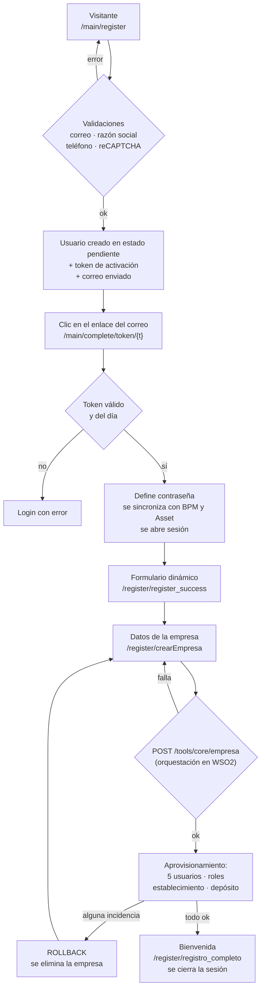

# Proceso de registración freemium — documento funcional

## Objetivo

Explica **qué hace y cómo funciona** el auto-registro de una empresa nueva en Trazalog (registro → activación por correo → formulario → alta de empresa → bienvenida), incluyendo el inventario exacto de datos que crea y las **dependencias de artefactos que viven en el repo `traz-tools`** sin las cuales el flujo no termina. Está escrito para quien tenga que entender el flujo, probarlo, desplegarlo en un ambiente nuevo o diagnosticar por qué se cortó a mitad de camino.

**No cubre**: el ABM de usuarios desde el panel de administración (ver `doc/creacion-usuarios.md`), el login ni el flujo OAuth/JWT (ver `doc/identity/`), ni el módulo de formularios dinámicos en sí (ver `doc/FORMULARIOS_DINAMICOS.md`).

---

## Metadata

| | |
|---|---|
| **Versión** | 2.0 — reemplaza por completo la v1 de este mismo archivo |
| **Fecha** | 2026-08-21 |
| **Relevado contra** | `traz-comp-dnato` rama `develop-v3` · `traz-tools` rama `develop-v3` |
| **Método** | Lectura de código en ambos repos. No se ejecutó el flujo ni se modificó nada |

> **Por qué se reescribió.** La v1 afirmaba que el registro *"NO crea automáticamente una empresa en `core.empresas`"* y terminaba el flujo en la pantalla de bienvenida. Eso dejó de ser cierto: hoy el registro **crea la empresa, la replica en AssetPlanner, crea el grupo y 16 roles en Bonita, crea 5 usuarios, y crea un establecimiento con su depósito**. La v1 tampoco documentaba ninguna dependencia con `traz-tools`. Se conservan de la v1 las partes que seguían siendo válidas (etapas 1 a 3).
>
> `doc/registracion.md` (marzo 2025) describe un flujo todavía anterior y **está obsoleto**: dice que no hay formulario dinámico y que no se crea nada en BPM. No usarlo.

---

## 1. Qué es, en una frase

Un visitante sin cuenta deja sus datos, activa su cuenta por correo, contesta un formulario breve, completa los datos fiscales de su empresa, y al terminar **su empresa queda operativa en las tres plataformas** (Trazalog Tools, AssetPlanner y Bonita BPM) con una estructura mínima de usuarios, roles, establecimiento y depósito. El usuario que se registró queda como **Administrador** de esa empresa.

Es el camino de alta *freemium*: no hay intervención manual de nadie de Trazalog en ningún punto.

---

## 2. Mapa del flujo


```mermaid
flowchart TD
    A["Visitante<br/>/main/register"] --> B{Validaciones<br/>correo · razón social<br/>teléfono · reCAPTCHA}
    B -->|error| A
    B -->|ok| C["Usuario creado en estado pendiente<br/>+ token de activación<br/>+ correo enviado"]
    C --> D["Clic en el enlace del correo<br/>/main/complete/token/{t}"]
    D --> E{Token válido<br/>y del día}
    E -->|no| L["Login con error"]
    E -->|sí| F["Define contraseña<br/>se sincroniza con BPM y Asset<br/>se abre sesión"]
    F --> G["Formulario dinámico<br/>/register/register_success"]
    G --> H["Datos de la empresa<br/>/register/crearEmpresa"]
    H --> I{"POST /tools/core/empresa<br/>(orquestación en WSO2)"}
    I -->|falla| H
    I -->|ok| J["Aprovisionamiento:<br/>5 usuarios · roles<br/>establecimiento · depósito"]
    J -->|alguna incidencia| K["ROLLBACK<br/>se elimina la empresa"]
    K --> H
    J -->|todo ok| M["Bienvenida<br/>/register/registro_completo<br/>se cierra la sesión"]
```

Las cinco etapas, con su controlador:

| # | Etapa | Ruta | Controlador |
|---|---|---|---|
| 1 | Solicitud de cuenta | `/main/register` | `Main::register()` → `Main::procesarRegistro()` |
| 2 | Activación y contraseña | `/main/complete/token/{token}` | `Main::complete()` |
| 3 | Formulario dinámico | `/register/register_success` | `Register::register_success()` → `guardarFormularioRegistro()` |
| 4 | Alta de empresa | `/register/crearEmpresa` | `Register::crearEmpresa()` → `guardarEmpresa()` |
| 5 | Bienvenida | `/register/registro_completo` | `Register::registro_completo()` |

---

## 3. Etapa 1 — Solicitud de cuenta

**Pantalla:** `application/views/register.php`. Pide nombre, apellido, correo, razón social de la empresa, teléfono y país.

**El combo de países** no sale de la base local: se pide a WSO2 con `GET {REST_CORE}/tablas/paises_registracion` (`User_model::obtenerPaisesRegistracion()`). Si esa llamada falla, la pantalla se muestra igual pero con el combo vacío y un mensaje de error — **el registro es imposible sin esa llamada**, porque el país es obligatorio.

**Validaciones, en orden** (`Main::register()`):

1. Todos los campos requeridos; el correo con formato válido.
2. `User_model::isDuplicate($email)` — el correo no puede existir en `seg.users`.
3. `User_model::existeRazonSocial($razon, $pais_id)` — no puede existir en `core.empresas` una empresa con ese `nombre` **o** esa `descripcion` (mayúsculas y espacios normalizados) en el mismo país y no eliminada. En esta etapa **se consulta sin CUIT**; en la etapa 4 se vuelve a consultar **con** CUIT (§6.1).
4. `User_model::validarTelefonoPorPais($telefono, $pais_id)` — expresión regular por país. Hay patrón propio para AR, BR, CL, UY, PE, EC, MX y BO; para cualquier otro país aplica un patrón genérico (`/^\+?[\d\s\-\(\)]{7,15}$/`).
5. reCAPTCHA, **sólo si** la configuración global del sitio lo tiene activo (`settings.recaptcha == 'yes'`, `User_model::getAllSettings()`).

**Si todo pasa**, `Main::procesarRegistro()`:

1. Genera el token: `substr(sha1(rand()), 0, 30)`.
2. `POST {API_CORE}/usuario/registro` con el usuario y el token. **El alta no se hace por SQL local: la hace WSO2** (§7.2). El rol que se envía es `'1'` — *Administrador* — porque quien se auto-registra es el administrador de su propia empresa.
3. Toma `respuesta.usr_id` de la respuesta y arma el token final como **`token_30 . usr_id`**, codificado en base64url. De ahí sale el enlace `.../main/complete/token/{base64url}`.
4. Envía el correo "Activar cuenta en Trazalog.com" desde `register@trazalog.com`, en HTML, con el enlace.

**Si el correo falla, el usuario y el token NO se borran** — es deliberado: la URL de activación queda registrada en el log (`#TRAZA|MAIN|REGISTRO_ACTIVACION_URL|`) y la cuenta se puede activar desde ahí o reintentando.

---

## 4. Etapa 2 — Activación y contraseña

**Pantalla:** `application/views/complete_password.php`.

`Main::complete()` decodifica el segmento base64 y lo parte: los primeros 30 caracteres son el token, el resto es el `user_id`. `User_model::isTokenValid()` busca esa combinación en `seg.tokens` y **exige que `created` sea la fecha de hoy**. No hay ventana en horas: un token emitido a las 23:50 deja de valer diez minutos después.

**Política de contraseña** (`required|min_length[10]|password_strong`, regla propia en `application/libraries/MY_Form_validation.php`):

- 10 caracteres o más
- al menos una mayúscula, una minúscula, un dígito y un carácter no alfanumérico

La misma política está duplicada en `public/js/password-strength.js` para la validación en pantalla; el propio código avisa que hay que cambiar las dos a la vez.

**Qué pasa al guardar:**

1. Se hashea con PBKDF2 (`Password::create_hash()`, formato `sha256:1000:salt:hash`) y se actualiza `seg.users`.
2. `POST {API_CORE}/usuario/bpm-asset` con la contraseña **en texto plano y su MD5**, para que WSO2 sincronice al usuario en Bonita BPM y en AssetPlanner (cada sistema espera un formato de credencial distinto).
3. **Si ese paso falla, el flujo NO se corta**: se avisa por pantalla ("tu cuenta quedó activada, pero no se pudo sincronizar con BPM") y se sigue. Es la decisión correcta de cara al usuario, pero deja una cuenta que puede no poder operar procesos; el error queda en el log.
4. Se abre sesión copiando todos los campos del usuario a `userdata`, y se redirige a la etapa 3.

---

## 5. Etapa 3 — Formulario dinámico

Cuatro preguntas de marketing (cómo conoció Trazalog, rubro, cantidad de empleados, problemas que enfrenta). Corre sobre el submódulo `traz-comp-formularios`, con `FORMULARIO_REGISTRO_ID = 72`.

**El detalle no obvio — el `empr_id` temporal:** `Register::aplicarEmprIdTemporalRegistro()` fuerza en sesión `empr_id = REGISTER_TEMP_EMPR_ID` (**9000**) antes de renderizar. Es necesario porque `Forms::obtenerValores()` resuelve las opciones de cada pregunta desde `core.tablas` filtrando por empresa, y las listas de este formulario están cargadas bajo el `empr_id` 9000. Al terminar, `limpiarEmprIdTemporalRegistro()` restaura el valor previo (o lo borra). En este punto del flujo el usuario todavía no tiene empresa, así que el "valor previo" normalmente está vacío.

> **Consecuencia operativa:** si en un ambiente nuevo no existen las filas de `core.tablas` con `empr_id = 9000`, el formulario se muestra con las preguntas sin opciones.

El guardado va por AJAX a `Register::guardarFormularioRegistro()`, que actualiza la instancia, escribe `seg.users.reg_info_id` y responde un JSON con el redirect a `register/crearEmpresa`.

---

## 6. Etapa 4 — Alta de empresa

Es la etapa con peso real: todo lo anterior tocaba una sola tabla propia.

**Pantalla:** `application/views/crear_empresa_page.php`. Muestra en modo lectura lo que ya se sabe del usuario (razón social, teléfono, correo, país) y pide **CUIT/identificador tributario, provincia y localidad** (los tres obligatorios), un logo opcional, y —cuando corresponde— el dominio corporativo.

Provincia y localidad se cargan encadenadas por AJAX contra `Register::getEstados()` / `getLocalidades()`, que pegan a WSO2. **Ojo con el parámetro:** esos endpoints esperan el **nombre legible** del país (`Argentina`), no el código (`AR`) — por eso `obtenerNombrePaisRegistroUsuario()` devuelve `core.tablas.descripcion` y no `valor`.

### 6.1 El dominio corporativo

El dominio determina las direcciones de los 5 usuarios que se van a crear. Se resuelve así:

- Si el correo del registrante **no** es de webmail público → se usa su dominio.
- Si **sí** lo es → la pantalla exige el campo `company_domain`, que se valida con `validarDominioCorporativo()`: forma de dominio correcta y **que no sea a su vez un webmail**.

La lista negra vive en `constants.php` y está por duplicado a propósito: `WEBMAIL_DOMAINS` (array) y `WEBMAIL_DOMAINS_CSV` (string). El código prefiere el array y cae al CSV si no está disponible — es una defensa contra el problema conocido de `define()` con arrays en PHP 5.6 en algunos ambientes.

Antes de llamar al API se revalida el duplicado, esta vez **con CUIT**: `existeRazonSocial($nombre, $pais_id, $cuit)`.

### 6.2 La llamada que crea la empresa

`Empresas::agregarEmpresa()` hace `POST {API_CORE}/empresa`. Del otro lado, WSO2 ejecuta una orquestación larga (§7.3).

**HTTP 200 no significa éxito.** `validarRespuestaApiCrearEmpresa()` interpreta el cuerpo en tres pasos: si viene un `Fault` de SOAP, es error; si viene `respuesta.error` con contenido, es error; sólo se considera éxito si aparece `respuesta.empr_id` con valor. Cualquier otra forma se trata como "no se pudo confirmar la creación".

### 6.3 Aprovisionamiento (`postProcesarEmpresa`)

Con el `empr_id` en la mano, y en este orden:

**a) Sesión BPM.** Se toma de `respuesta.bpmSession` si el API la devolvió; si no, se hace login a Bonita con `BPM_ADMIN_USER`/`BPM_ADMIN_PASS`; si eso también falla, se usa `BPM_SESSION_FALLBACK`, que es una sesión hardcodeada en `constants.php` y **casi con seguridad está vencida** — sirve para que el código no explote, no para que funcione.

**b) Cinco usuarios por defecto**, definidos en `REGISTRACION_USUARIOS_DEFAULT_JSON` (JSON en vez de array, otra vez por PHP 5.6):

| Alias → correo | Roles que se le asignan |
|---|---|
| `usuario@{dominio}` | Solicitante de Almacén · Solicitante de Mantenimiento |
| `almacen@{dominio}` | Responsable de Almacén |
| `panol@{dominio}` | Responsable de Pañol |
| `produccion@{dominio}` | Responsable de Producción |
| `mantenimiento@{dominio}` | Supervisor de Mantenimiento · Planificador de Mantenimiento |

Todos se crean con `POST {API_CORE}/usuario` y la contraseña de `REGISTRACION_PASSWORD_DEFAULT`, que hoy vale **`12345`**. Si el correo ya existía, no se recrea: sólo se le reasignan los roles.

**c) Rol del registrante.** Al usuario que se registró se le asigna `Administrador`.

**d) Establecimiento y depósito.** `Establecimiento Principal` (sin dirección), con `Deposito 1` dentro, y como encargado el usuario `almacen@{dominio}` — el vínculo entre el depósito y ese alias sale de `REGISTRACION_DEPOSITO_DEFAULT_ENCARGADO_ALIAS`, que **tiene que coincidir con una clave del JSON de usuarios**, o el depósito queda sin encargado.

**Cómo se nombran los roles.** El nombre completo es `"{Rol base} {Razón social}"` — por ejemplo `Responsable de Almacén Minera del Sur`. `Register::obtenerRolBpmPorNombre()` primero busca coincidencia exacta contra el catálogo de Bonita y, si no la encuentra, cae a una búsqueda por subcadena (que contenga el rol base **y** la razón social). Ese fallback existe porque los nombres no siempre alinean carácter a carácter.

### 6.4 Rollback

Cualquier incidencia durante §6.3 acumula un *warning*. Si al terminar hay al menos uno, **el alta se revierte**: `Empresas::eliminarEmpresa($emprId)`, que es un soft-delete (`eliminado = TRUE`).

Dos cosas para tener presentes:

- **La reversión apunta directo al DataService, no al API.** Está comentado en el código: `toolsCOREAPI` sólo expone `/empresa` en POST, y el DELETE devuelve 405. Mismo patrón usan `Establecimientos::eliminarEstablecimiento()` y `eliminarDeposito()`.
- **La reversión es parcial por diseño.** Borra la empresa de `core.empresas`. **No** borra la empresa replicada en AssetPlanner, ni el grupo, ni los 16 roles, ni los mapeos de actores en Bonita, ni los usuarios que alcanzaron a crearse. Si el rollback también falla, el mensaje al usuario lo dice: *"la reversión automática falló (empr_id N). Contactá soporte para limpiar datos huérfanos."*

Dentro del establecimiento sí hay rollback fino: si falla el depósito se borra el establecimiento; si falla el encargado se borran los dos.

---

## 7. Dependencias en `traz-tools` — sin esto, el flujo no termina

Dnato **no escribe** la empresa, los usuarios ni los roles en la base: los pide por HTTP a WSO2. Todos los artefactos que atienden esas llamadas viven en el repo `traz-tools`. Esta sección los enumera para que un ambiente nuevo se pueda dar de alta y para que un flujo cortado se pueda diagnosticar.

### 7.1 Los cuatro puntos de entrada

Todo cuelga de una única variable en `application/config/constants.php`:

```php
$wso2_base = 'http://localhost:8290';          // ← lo único que cambia por ambiente
define('REST_BPM',   $wso2_base.'/tools/bpm');          // API   toolsBPMAPI
define('API_CORE',   $wso2_base.'/tools/core');         // API   toolsCOREAPI
define('HOST',       $wso2_base);
define('REST_CORE',  HOST.'/services/COREDataService'); // DataService, directo
define('REST_CORE_PAISES', REST_CORE.'/tablas/paises_registracion');
```

Dos observaciones que importan:

- **Dnato llama al DataService directamente**, sin pasar por ninguna API, para los países, estados, localidades, establecimientos, depósitos y el rollback de empresa. Eso significa que el MI tiene que exponer `/services/` a Dnato, no sólo `/tools/`.
- En DEV `$wso2_base` apunta a `localhost:8290`; en demo/test, a `10.142.0.13:8280`. Cada ambiente tiene su propio `constants.php` (hay ejemplos sin trackear en `development/constants.demo-prod.example.php`).

### 7.2 Qué consume cada etapa

| Etapa | Llamada desde Dnato | Artefacto en `traz-tools` |
|---|---|---|
| 1 · combo de países | `GET {REST_CORE}/tablas/paises_registracion` | `COREDataService` — resource `/tablas/{tabla}` |
| 1 · alta del usuario | `POST {API_CORE}/usuario/registro` | `toolsCOREAPI` → `COREDataService` `/usuario/duplicado/{email}`, `/usuario/registro`, `/token` |
| 2 · sincronía BPM/Asset | `POST {API_CORE}/usuario/bpm-asset` | `toolsCOREAPI` → Bonita + AssetPlanner |
| 4 · provincias | `GET {REST_CORE}/estados/pais/{pais}` | `COREDataService` |
| 4 · localidades | `GET {REST_CORE}/localidades/pais/{pais}/estado/{estado}` | `COREDataService` |
| 4 · alta de empresa | `POST {API_CORE}/empresa` | `toolsCOREAPI` (orquestación, §7.3) |
| 4 · usuarios por defecto | `POST {API_CORE}/usuario` | `toolsCOREAPI` → `/usuario/duplicado/{email}`, `/usuario`, `/users_business`, `/assetuser/add`, `{api_url}/bpm/users` |
| 4 · asignación de roles | `POST {API_CORE}/rol/asignar` | `toolsCOREAPI` → `/membership`, `{api_url}/bpm/memberships` |
| 4 · catálogo BPM | `GET {REST_BPM}/groups/{s}` · `/roles/{s}` · `/role/porNombre/{s}` | `toolsBPMAPI` |
| 4 · establecimiento | `POST {REST_CORE}/establecimiento` | `COREDataService` |
| 4 · depósito | `POST {REST_CORE}/deposito/establecimiento` | `COREDataService` |
| 4 · encargado | `POST {REST_CORE}/deposito/encargado` | `COREDataService` |
| 4 · rollback | `DELETE {REST_CORE}/empresa` · `/establecimiento` · `/deposito` · `/deposito/encargado` | `COREDataService` |

### 7.3 Qué hace `POST /tools/core/empresa` por dentro

Vale la pena conocerlo porque explica de dónde salen los nombres de grupos y roles, y porque cada paso es un punto de falla posible:

1. `POST {ds}/COREDataService/empresa` → devuelve el `empr_id` en `GeneratedKeys`.
2. `POST {ds}/COREDataService/empresa/asset` → replica la empresa en AssetPlanner (MySQL) → `asset_id_empresa`.
3. `PUT {ds}/COREDataService/empresa/asset-id` → escribe `core.empresas.empr_id_mysql` con ese id. **No bloqueante**: si falla, sólo loguea un WARN pidiendo reconciliación manual. **Este paso sólo existe en una de las dos copias del artefacto** (§7.4).
4. `POST {api}/bpm/group` → crea el grupo en Bonita con el nombre **`{empr_id}-{razón social}`**.
5. `POST {api}/bpm/profileMember` → asocia el perfil `1` a ese grupo.
6. **16 invocaciones** a la sequence `toolsCreateRole`, una por rol, todos nombrados `"{Rol base} {razón social}"`: Responsable de Almacén · Solicitante de Almacén · Responsable de Producción · Responsable de Lote · Responsable de Pañol · Planificador de Tareas · Responsable de Procesos · Supervisor de Mantenimiento · Planificador de Mantenimiento · Solicitante de Mantenimiento · Mantenedor · Administrador · SMA - Transportista · SMA - Generador · SMA - Operario Descarga · SMA - Operador de Bascula.
7. Una tanda de **15 mapeos** (14 vía `toolsBpmActorMembership`, 1 vía `toolsBpmActorGrupo`): asocia cada actor de cada proceso Bonita al rol correspondiente. Los procesos cubiertos son *Pedido de Recursos Materiales*, *proceso de Mantenimiento AssetPlanner*, *TST001 - Tarea Planificada* y la familia *TERSU-BPM01/02/03*. Acá el rol se referencia **con prefijo**: `{empr_id}-{Rol base} {empresa}`.
8. Responde `{"respuesta":{"resultado":"ok","empr_id":"…","bpmSession":"…"}}`.

Si el paso de asset o los de Bonita fallan, la propia API dispara rollbacks encadenados de lo que ya había creado.

> **Convención de nombres, que confunde seguido:** el **grupo** de Bonita lleva prefijo (`9000-Termotanques`), los **roles** no (`Administrador Termotanques`), y los **mapeos de actores** vuelven a llevarlo. Del lado de Dnato, `Oauthlogin::_getMemberships()` espera el grupo **con** prefijo, y `Register::membershipExists()` consulta `seg.memberships_users` por el rol **sin** prefijo. Las dos cosas son correctas, pero conviven.

### 7.4 ⚠️ Hay dos copias del `COREDataService`, y no son iguales

No existe versionado semántico de estos artefactos: la "versión" es la copia del repo que se empaquetó en el `.car` desplegado. En `traz-tools` conviven dos copias vivas y **divergen exactamente en dos cosas, las dos de la cadena `empr_id_mysql`**:

| | `_backend/api/dataservice/COREDataService.dbs` | `_backend/api/ToolsAPIProject/.../data-services/COREDataService.dbs` |
|---|---|---|
| Tamaño | 90 queries / 91 resources | 92 queries / 93 resources |
| `GET /empresa/{empr_id}` (`getEmpresaById`) | ❌ **ausente** | ✅ presente |
| `PUT /empresa/asset-id` (`updateEmpresaAssetId`) | ❌ **ausente** | ✅ presente |
| Todo lo demás que usa la registración | ✅ idéntico | ✅ idéntico |

Lo mismo pasa con la API: `_backend/api/toolsCOREAPI.xml` **no tiene** el paso `link_asset_id_url` (§7.3 paso 3); la copia de `ToolsAPIProject` sí.

**Por qué importa, y por qué son las dos caras de la misma moneda:**

- `PUT /empresa/asset-id` es lo que **escribe** `empr_id_mysql` cuando se crea la empresa (registración).
- `GET /empresa/{empr_id}` es lo que lo **lee** cuando se emite el JWT — `Empresas::getEmpresaById()`, llamado desde `Oauth::_issueCode()` y `Oauthlogin::_resolveCompany()`.

Si el WSO2 que atiende a Dnato corre la copia sin esos dos artefactos, el efecto es silencioso y en cadena: la empresa se crea sin `empr_id_mysql`, y después el JWT sale con ese claim vacío, y las tools `man_*` (que usan el id nativo de `assetv2`) no encuentran datos. Nada falla con un error visible.

Esto ya está registrado como bloqueo en `traz-tools/doc/v3/STATE.md`: *"el WSO2 backend de Dnato (`vm-demo-trazalog:8283`) está desactualizado — no expone `/empresa/{empr_id}`"*. Es una instancia **distinta** del MI de la fachada MCP: actualizar uno no actualiza el otro.

> **Regla operativa:** verificar siempre **desempaquetando el `.car` desplegado**, no mirando el repo — un checkout desactualizado en el servidor produce un CAR con la configuración equivocada. Y recordar que el deploy del `.car` es **atómico**: si cualquier `.dbs` no puede conectar a su base al momento del deploy, se revierte el CAR completo (y el síntoma es un engañoso "artefacto inexistente").

### 7.5 Configuración de WSO2 de la que depende el flujo

- **`conf:tools/apiconfig.xml`** (registry resource). `toolsCOREAPI` lee de ahí `api_url` y `dataservices_url` para armar todas sus llamadas internas. Si apunta al host equivocado, la API responde pero orquesta contra otro ambiente. Hay ejemplo en `development/config/tools/apiconfig.demo-prod.example.xml`; el del repo `traz-tools` apunta hoy a `http://10.142.0.13:8280`.
- **Sequences** `toolsCreateRole`, `toolsBpmActorMembership`, `toolsBpmActorGrupo`, `toolsFault` — todas tienen que estar en el mismo CAR que la API.
- **Bonita accesible** desde el MI, con los procesos ya desplegados: los mapeos de actores del paso 7 buscan procesos **por nombre**. Un proceso que no esté desplegado hace fallar (o saltear) su mapeo.
- **Datasources** del MI conectando a PostgreSQL (`core`, `seg`, `frm`) y a MySQL (`assetv2`).

### 7.6 Checklist de verificación de un ambiente

Desde el host de Dnato, reemplazando `$WSO2` por el `$wso2_base` de ese `constants.php`:

```bash
# 1. El DataService responde y tiene los países cargados
curl -s $WSO2/services/COREDataService/tablas/paises_registracion | head -c 300

# 2. Los dos resources de la cadena empr_id_mysql existen  (404 = CAR viejo, ver §7.4)
curl -s -o /dev/null -w "GET /empresa/1 -> %{http_code}\n" $WSO2/services/COREDataService/empresa/1

# 3. La API CORE está publicada
curl -s -o /dev/null -w "POST /tools/core/empresa -> %{http_code}\n" -X POST $WSO2/tools/core/empresa -d '{}'

# 4. La API BPM responde el catálogo de grupos  (session = BPM_ROLES_SESSION_URL de constants.php)
curl -s "$WSO2/tools/bpm/groups/<session-urlencoded>" | head -c 300
```

Y en la base: que existan filas de `core.tablas` con `empr_id = 9000` (opciones del formulario de la etapa 3) y que `core.empresas` tenga la columna `empr_id_mysql` — **esa columna no tiene migración SQL formal en ningún repo**, está anotada como bloqueante para PROD en el STATE de `traz-tools`.

---

## 8. Inventario de lo que crea un registro completo

Un solo registro exitoso deja, para una empresa de razón social `E` con dominio `d`:

| Sistema | Objeto | Cantidad |
|---|---|---|
| PostgreSQL `seg` | Usuario registrante (rol Administrador) | 1 |
| PostgreSQL `seg` | Token de activación | 1 |
| PostgreSQL `seg` | Usuarios por defecto (`usuario`, `almacen`, `panol`, `produccion`, `mantenimiento` `@d`) | 5 |
| PostgreSQL `seg` | Membresías usuario↔rol (7 de los usuarios por defecto + `Administrador` del registrante) | 8 |
| PostgreSQL `frm` | Instancia del formulario + respuestas | 1 |
| PostgreSQL `core` | Empresa | 1 |
| PostgreSQL `core` | Establecimiento + depósito + encargado | 1 + 1 + 1 |
| MySQL `assetv2` | Empresa replicada | 1 |
| MySQL `assetv2` | Usuarios replicados | 6 |
| Bonita BPM | Grupo `{empr_id}-E` | 1 |
| Bonita BPM | Roles `{Rol} E` | 16 |
| Bonita BPM | Usuarios | 6 |
| Bonita BPM | Mapeos actor↔rol/grupo por proceso (14 por rol + 1 por grupo) | 15 |

**No existe ningún procedimiento automático de baja de todo esto.** El rollback de §6.4 sólo cubre el caso de un alta que se cortó a mitad, y ni siquiera por completo. Es el motivo por el que el relevamiento DocTest recomienda **no automatizar el camino feliz** de este flujo hasta que exista una decisión al respecto (`traz-tools/doctest/catalogo/dnato/RESUMEN-RELEVAMIENTO-DNATO.md` §3.1, punto 3).

---

## 9. Modos de fallo conocidos

| Síntoma | Causa probable | Dónde mirar |
|---|---|---|
| El combo de países aparece vacío | El DataService no responde o `$wso2_base` apunta mal | §7.6 chequeo 1 |
| El correo de activación no llega | Falla de SMTP. **El usuario y el token quedaron creados** | Log: `#TRAZA\|MAIN\|REGISTRO_ACTIVACION_URL\|` — la URL sirve igual |
| "Token inválido o expirado" al día siguiente | El token vale **sólo el día en que se emitió** | §4 |
| El formulario aparece sin opciones en las preguntas | Faltan filas de `core.tablas` con `empr_id = 9000` | §5 |
| "No se pudo confirmar la creación de la empresa" | HTTP 200 con `Fault` o `respuesta.error` | Log de `toolsCOREAPI`; §6.2 |
| El alta se revierte con "no se pudo localizar el rol X" | Los 16 roles no se crearon en Bonita, o el catálogo que devuelve `toolsBPMAPI` viene paginado/incompleto | §7.3 paso 6; el log DEBUG imprime hasta 20 `displayName` cercanos |
| Empresa creada pero `empr_id_mysql` en NULL | El CAR desplegado no tiene `PUT /empresa/asset-id` | §7.4 |
| El JWT sale con `empr_id_mysql` vacío | Lo mismo, o falta `GET /empresa/{empr_id}` | §7.4 |
| El depósito queda sin encargado | `REGISTRACION_DEPOSITO_DEFAULT_ENCARGADO_ALIAS` no coincide con ninguna clave del JSON de usuarios | §6.3 d |
| Todo el alta se revierte sin causa clara | Sesión de Bonita vencida y se cayó al `BPM_SESSION_FALLBACK` hardcodeado | §6.3 a |

---

## 10. Riesgos y deuda registrados

Se listan porque cualquiera que lea este documento se los va a cruzar. **Ninguno se corrigió** y algunos requieren decisión del PM.

1. **Los 5 usuarios por defecto nacen con la contraseña `12345`** (`REGISTRACION_PASSWORD_DEFAULT`), y la pantalla de bienvenida la muestra en pantalla. No hay nada que obligue a cambiarla en el primer ingreso.
2. **`BPM_SESSION_FALLBACK` es una sesión de Bonita hardcodeada** en `constants.php`, junto con `BPM_ADMIN_PASS`. Sirve de red pero está vencida.
3. **El rollback es parcial** (§6.4): no deshace nada de AssetPlanner ni de Bonita.
4. **`POST /usuario/bpm-asset` viaja con la contraseña en texto plano y su MD5** (§4). Es lo que esperan los sistemas de destino, pero implica que la credencial cruza la red en claro si el tramo no va sobre TLS.
5. **La política de contraseña está duplicada** entre PHP y JavaScript, sincronizada a mano.
6. **`Register::guardarFormularioRegistro()` cae a `user_id = 1`** cuando no hay sesión ("usuario de prueba"). Es un resto de depuración que escribe `reg_info_id` sobre un usuario real.
7. **No hay baja automática de un alta completa** (§8).
8. La configuración del sitio (título, zona horaria, reCAPTCHA, tema) **parece global y no por empresa** — hallazgo del relevamiento DocTest, sin verificar acá.

Para los hallazgos del módulo de **identidad** (OAuth/JWT), ver `doc/v3/hallazgos-identidad-para-mcp.md`.

---

## 11. Referencias

**En este repo**

- `application/controllers/Main.php` — `register()`, `procesarRegistro()`, `complete()`
- `application/controllers/Register.php` — etapas 3, 4 y 5
- `application/models/User_model.php` — validaciones, alta, tokens
- `application/models/Empresas.php`, `Establecimientos.php`, `Roles.php` — clientes REST hacia WSO2
- `application/libraries/MY_Form_validation.php` — regla `password_strong`
- `application/libraries/Password.php` — PBKDF2
- `application/config/constants.php` — **toda la configuración del flujo**
- `doc/FORMULARIOS_DINAMICOS.md` — el módulo de la etapa 3
- `doc/creacion-usuarios.md` — alta de usuarios desde el ABM (flujo distinto)
- `doc/v3/hallazgos-identidad-para-mcp.md` — hallazgos de OAuth/JWT
- ~~`doc/registracion.md`~~ — **obsoleto**, describe un flujo anterior

**En `traz-tools`**

- `_backend/api/toolsCOREAPI.xml` y `_backend/api/ToolsAPIProject/.../apis/toolsCOREAPI.xml` — las dos copias (§7.4)
- `_backend/api/toolsBPMAPI.xml` — catálogo y altas de Bonita
- `_backend/api/dataservice/COREDataService.dbs` y `.../ToolsAPIProject/.../data-services/COREDataService.dbs` — las dos copias
- `_backend/api/toolsCreateRole.xml`, `toolsBpmActorMembership.xml`, `toolsBpmActorGrupo.xml`
- `_backend/api/apiconfig.xml` — `api_url` / `dataservices_url`
- `doc/v3/STATE.md` — estado vivo del proyecto (fuente única)
- `doctest/catalogo/dnato/RESUMEN-RELEVAMIENTO-DNATO.md` — los 21 casos funcionales de DNATO
