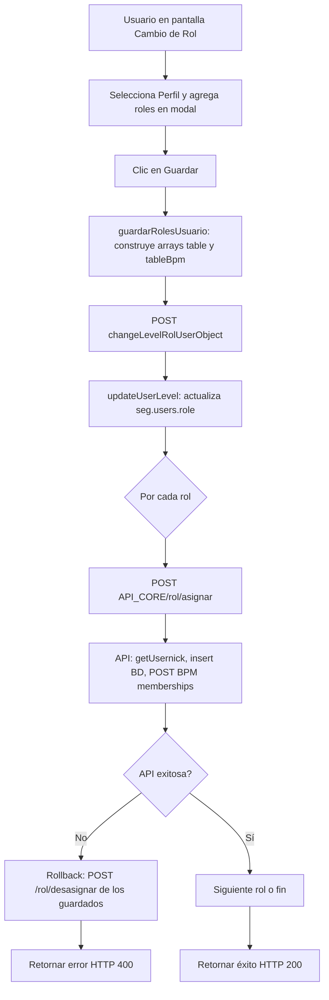
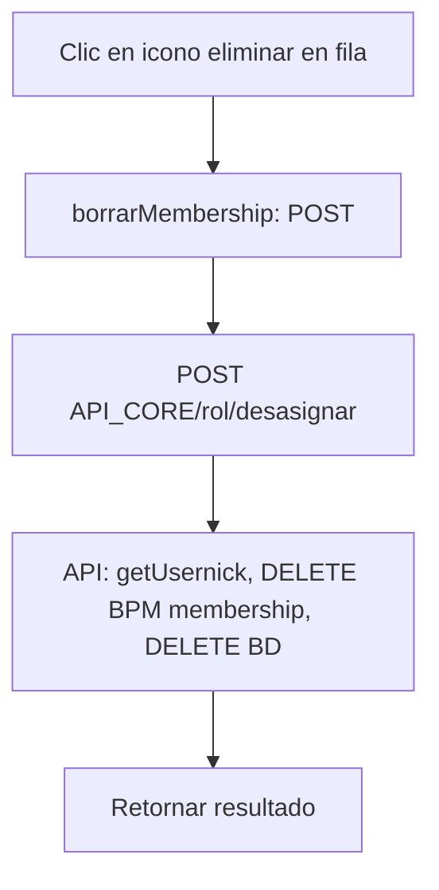

# Asignación y Desasignación de Roles

## Descripción general

Este documento describe el flujo de asignación y desasignación de roles a usuarios en Trazalog Tools. La asignación y desasignación se realizan mediante los recursos **`POST /tools/core/rol/asignar`** y **`POST /tools/core/rol/desasignar`** de la API toolsCOREAPI, que concentran la lógica en BD (PostgreSQL) y BPM (Bonita).

Los roles se gestionan en dos niveles:

1. **Local (PostgreSQL)**: tabla `seg.memberships_users` para menús y lógica de la aplicación.
2. **BPM (Bonita)**: grupos y roles de Bonita, sincronizados vía API WSO2 (tools/bpm).

---

## Diagrama de flujo

### Asignación de roles



### Desasignación de roles



---

## APIs utilizadas

### API_CORE (toolsCOREAPI - tools/core)

| Recurso | Método | Uso |
|---------|--------|-----|
| `/rol/asignar` | POST | Asignar rol a usuario (BD + BPM, con rollback si falla BPM) |
| `/rol/desasignar` | POST | Desasignar rol de usuario (BPM + BD) |

**Payload:** `email`, `group`, `role`, `group_id`, `role_id`, `bpmSession`

### REST_BPM (WSO2 tools/bpm) – consumido por toolsCOREAPI

| Endpoint | Método | Uso |
|----------|--------|-----|
| `/users/{usernick}/session/{session}` | GET | Obtener `user_id` del usuario en BPM |
| `/memberships` | POST | Asignar rol/grupo a usuario |
| `/membership` | DELETE | Quitar rol/grupo de usuario |
| `/groups/{token}` | GET | Listar grupos BPM |
| `/roles/{token}` | GET | Listar roles BPM |

### Base de datos PostgreSQL

| Tabla | Uso |
|-------|-----|
| `seg.users` | Campo `role` (nivel/perfil del usuario) |
| `seg.memberships_users` | Asociación email–group–role (memberships locales) |

---

## Manejo de errores

| Situación | Comportamiento |
|-----------|----------------|
| Fallo en `updateUserLevel` | Mensaje "Fallo cambio de nivel", HTTP 400 |
| Usuario no encontrado | Mensaje "Usuario no encontrado", HTTP 400 |
| Fallo en `guardarMembership` (BD) | Rollback de lo guardado, mensaje "Fallo asignacion de roles", HTTP 400 |
| Fallo en `guardarMembershipBPM` (API) | Rollback de memberships locales, mensaje "Fallo asignación de roles Bpm", HTTP 400 |
| Usuario no existe en BPM | `getInfoBPM` retorna null, se trata como fallo en BPM |
| API BPM con HTTP >= 300 | Se loguea el error, se retorna null, rollback si corresponde |

---

## Configuración

### Sesión BPM

**Archivo**: `application/config/constants.php`

```php
$bpm_roles_session_base = 'X-Bonita-API-Token=xxx;JSESSIONID=xxx;bonita.tenant=1;';
define('BPM_ROLES_SESSION', '"' . $bpm_roles_session_base . '"');
define('BPM_ROLES_SESSION_URL', rawurlencode($bpm_roles_session_base));
```

**Actualizar sesión**:

1. Hacer login en Bonita (o usar API de login).
2. Extraer `X-Bonita-API-Token` y `JSESSIONID` de la respuesta/cookies.
3. Actualizar `$bpm_roles_session_base` con el formato indicado.

### Archivos involucrados

| Archivo | Función |
|---------|---------|
| `application/controllers/Main.php` | `changeLevelRolUserObject`, `deleteLevelRolUser`, `guardarMembership` |
| `application/models/Roles.php` | `getInfoBPM`, `guardarMembershipBPM`, `deleteMembershipBPM`, `getBpmGroups`, `getBpmRoles` |
| `application/models/User_model.php` | `guardarMembership`, `borrarMembership`, `updateUserLevel`, `getUserInfoByEmail` |
| `application/views/changeleveluser.php` | `guardarRolesUsuario`, modal de agregar rol |

---

## Pruebas manuales con Empresa de Prueba

### Requisitos previos

- Usuario admin logueado.
- Usuario de prueba en `seg.users` con `usernick` existente en Bonita.
- WSO2 MI con toolsbpmAPI desplegado.
- Grupos y roles válidos en BPM (Empresa de Prueba como grupo).

### Asignación de roles

1. Ir a **Usuarios** → seleccionar usuario → **Cambiar Niveles**.
2. Seleccionar **Perfil** en el dropdown.
3. Clic en **Agregar Rol**.
4. Elegir **Empresa de Prueba** (o grupo válido) y un **Rol**.
5. Clic en **Agregar** (se añade la fila a la tabla).
6. Repetir 4–5 para agregar más roles si se desea.
7. Clic en **Guardar**.
8. Verificar mensaje de éxito.
9. Consultar en PostgreSQL: `SELECT * FROM seg.memberships_users WHERE email = 'EMAIL_USUARIO';`

### Desasignación de roles

1. En la misma pantalla, localizar la fila del rol a eliminar.
2. Clic en el icono de eliminar (papelera).
3. Verificar que la fila desaparece.
4. Consultar en PostgreSQL que el registro ya no existe.

### Verificación en BPM

- Comprobar en Bonita que el usuario tiene los memberships (grupo–rol) esperados.
- Tras eliminar, verificar que el membership correspondiente ya no aparece.
