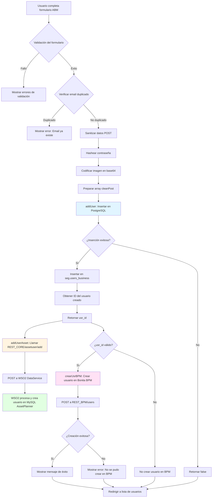
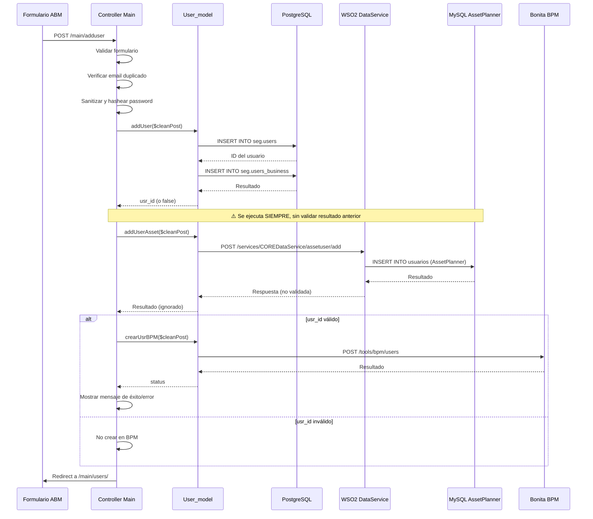
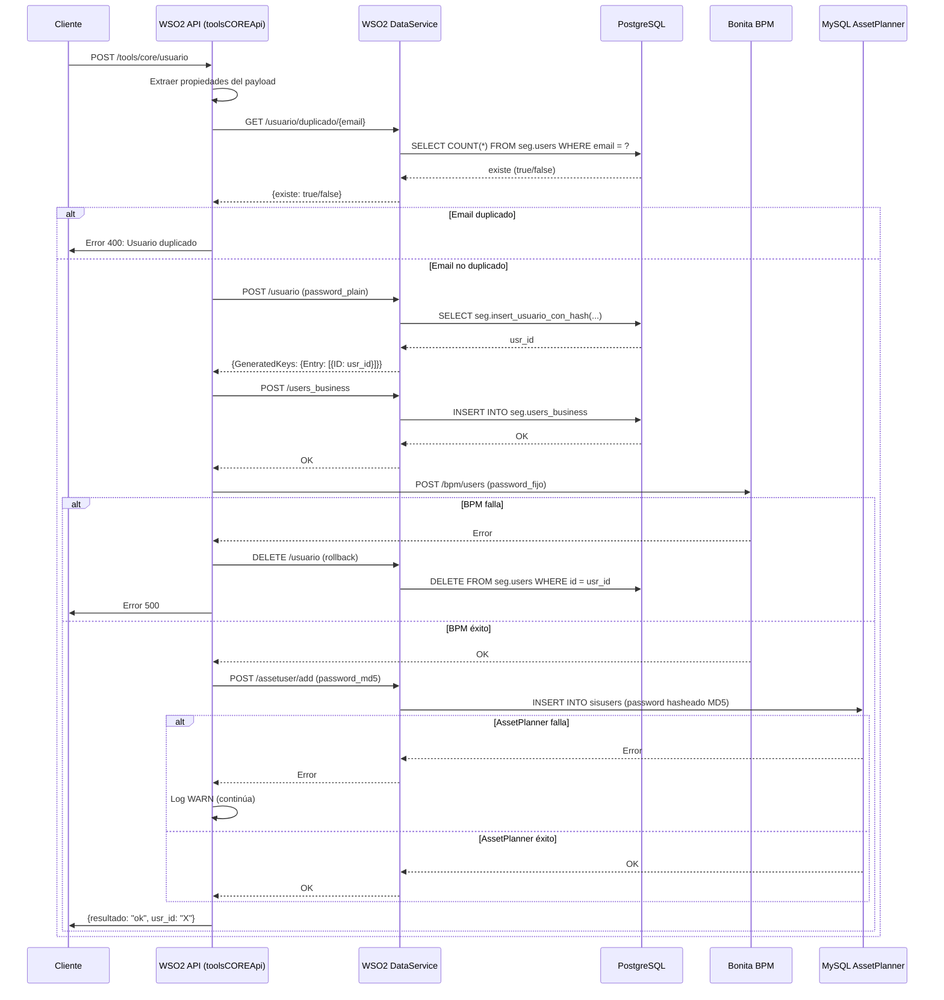
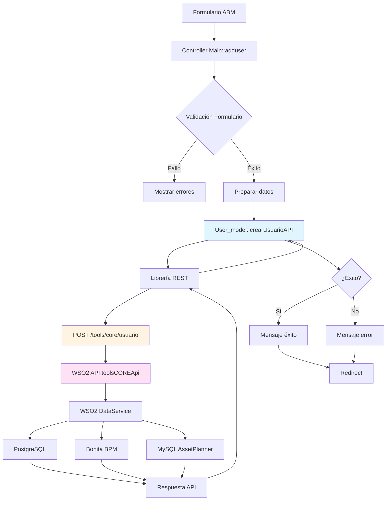

# Análisis del Flujo de Creación de Usuarios - Trazalog Tools

## 📋 Descripción General

Este documento describe el flujo completo de creación de usuarios en Trazalog Tools, desde el formulario ABM hasta los diferentes backends que se impactan. Se incluye un análisis detallado del proceso específico para AssetPlanner, que utiliza una base de datos MySQL.

## 🏗️ Arquitectura del Sistema

### Componentes Principales

1. **Frontend (Vista)**: `application/views/adduser.php`
2. **Controlador**: `application/controllers/Main.php` → método `adduser()`
3. **Modelo**: `application/models/User_model.php`
4. **Librería REST**: `application/libraries/REST.php`
5. **Backends Externos**:
   - PostgreSQL (Base de datos principal - schema `seg`)
   - MySQL (AssetPlanner - vía WSO2 DataService)
   - Bonita BPM (Sistema de gestión de procesos)

## 🔄 Flujo Completo de Creación de Usuarios

### Diagrama de Flujo



### Flujo Detallado Paso a Paso

#### 1. **Formulario ABM (Frontend)**

**Archivo**: `application/views/adduser.php`

**Datos capturados**:
- `firstname` (Nombre)
- `lastname` (Apellido)
- `email` (Email)
- `usernick` (Nick de usuario)
- `image` (Imagen de perfil - archivo)
- `telefono` (Teléfono)
- `dni` (DNI)
- `business` (Empresa - dropdown)
- `role` (Rol del sistema - dropdown)
- `password` (Contraseña)
- `passconf` (Confirmación de contraseña)

**Acción**: POST a `/main/adduser`

#### 2. **Controlador - Validación y Preparación**

**Archivo**: `application/controllers/Main.php` → método `adduser()`

**Líneas clave**: 214-327

**Proceso**:

```php
// 1. Validación de permisos (debe ser admin)
if($dataLevel == "is_admin") {
    
    // 2. Validación de formulario
    $this->form_validation->set_rules('firstname', 'First Name', 'required');
    $this->form_validation->set_rules('lastname', 'Last Name', 'required');
    $this->form_validation->set_rules('email', 'Email', 'required|valid_email');
    $this->form_validation->set_rules('role', 'role', 'required');
    $this->form_validation->set_rules('password', 'Password', 'required|min_length[5]');
    $this->form_validation->set_rules('passconf', 'Password Confirmation', 'required|matches[password]');
    
    // 3. Verificar duplicados
    if($this->user_model->isDuplicate($this->input->post('email'))) {
        // Error: Email ya existe
    }
    
    // 4. Sanitizar y preparar datos
    $post = $this->input->post(NULL, TRUE);
    $cleanPost = $this->security->xss_clean($post);
    
    // 5. Hashear contraseña
    $hashed = $this->password->create_hash($cleanPost['password']);
    
    // 6. Codificar imagen
    $cleanPost['image'] = base64_encode(file_get_contents($_FILES['image']['tmp_name']));
    
    // 7. Preparar array final
    $cleanPost['password'] = $hashed;
    // ... otros campos
}
```

#### 3. **Creación en PostgreSQL (Base Principal)**

**Archivo**: `application/models/User_model.php` → método `addUser()`

**Líneas clave**: 284-344

**Proceso**:

```php
// 1. Insertar en seg.users
$q = $this->db->insert('seg.users', $string);
// Campos: first_name, last_name, email, telefono, dni, usernick, 
//         password (hasheado), role, status='approved', 
//         banned_users='unban', depo_id, image_name, image

// 2. Si éxito, insertar en seg.users_business
if($q) {
    $bs = $this->db->insert('seg.users_business', array(
        'email' => $d['email'],
        'busines' => $d['business']
    ));
    
    // 3. Obtener ID del usuario creado
    $this->db->select_max('id');
    $query = $this->db->get('seg.users');
    $userInfo = $query->row('id');
    
    return $userInfo; // Retorna el ID o false
}
```

**Tablas afectadas**:
- `seg.users` (tabla principal de usuarios)
- `seg.users_business` (relación usuario-empresa)

**Orden**: **1º** - Primera operación en el flujo

#### 4. **Creación en AssetPlanner (MySQL vía WSO2)**

**Archivo**: `application/models/User_model.php` → método `addUserAsset()`

**Líneas clave**: 685-700

**Proceso**:

```php
// 1. Preparar payload para WSO2 DataService
$post['_post_assetuser_add'] = array(
    'nick' => $data['usernick'],
    'name' => $data['firstname'],
    'lastName' => $data['lastname'],
    'pass' => $data['password'], // ⚠️ PROBLEMA: Envía password hasheado
    'image' => $data['image']     // Imagen en base64
);

// 2. Llamar al servicio REST
$url = REST_CORE."/assetuser/add";
// REST_CORE = 'http://10.142.0.13:8280/services/COREDataService'
$aux = $this->rest->callAPI("POST", $url, $post);
```

**Endpoint WSO2**: `POST /services/COREDataService/assetuser/add`

**Base de datos**: MySQL (AssetPlanner)

**Configuración WSO2**: Utiliza el datasource `AssetPlannerDataSource` configurado en WSO2 DataService.

**Orden**: **2º** - Se ejecuta inmediatamente después de `addUser()`, **independientemente del resultado**

**⚠️ PROBLEMA IDENTIFICADO**: 
- El método `addUserAsset()` se ejecuta **siempre**, incluso si `addUser()` falla
- No valida el resultado de `addUser()` antes de ejecutarse
- Envía el password hasheado (bcrypt) a AssetPlanner, que probablemente espera password en texto plano o con otro formato
- No valida la respuesta del servicio REST

#### 5. **Creación en Bonita BPM**

**Archivo**: `application/models/User_model.php` → método `crearUsrBPM()`

**Líneas clave**: 351-370

**Proceso**:

```php
// 1. Preparar datos para BPM
$datos = array(
    "userName" => $cleanPost['usernick'],
    "password" => BPM_USER_PASS, // ⚠️ Password hardcodeado: 'bpm'
    "password_confirm" => BPM_USER_PASS,
    "firstname" => $cleanPost['firstname'],
    "lastname" => $cleanPost['lastname'],
    "title" => "Sr",
    "job_title" => "Human resources benefits"
);

// 2. Llamar al servicio REST de BPM
$aux = $this->rest->callAPI("POST", REST_BPM."/users", $post);
// REST_BPM = 'http://10.142.0.13:8280/tools/bpm'
```

**Endpoint BPM**: `POST /tools/bpm/users`

**Orden**: **3º** - Solo se ejecuta si `addUser()` retorna un `usr_id` válido

**Condición**: 
```php
if($usr_id) {
    $status = $this->user_model->crearUsrBPM($cleanPost);
    if ($status) {
        // Éxito
    } else {
        // Error: No se pudo crear en BPM
    }
}
```

**⚠️ PROBLEMA IDENTIFICADO**:
- Usa password hardcodeado (`BPM_USER_PASS = 'bpm'`) en lugar del password del usuario
- Session token hardcodeado (TODO comentado en código)
- No se valida si la creación en AssetPlanner fue exitosa antes de crear en BPM

## 📊 Orden de Ejecución de Backends

### Secuencia Temporal



### Resumen del Orden

1. **PostgreSQL** (`seg.users` y `seg.users_business`)
   - Orden: **1º**
   - Condición: Validación de formulario exitosa y email no duplicado
   - Validación: Se verifica el resultado antes de continuar

2. **MySQL AssetPlanner** (vía WSO2 DataService)
   - Orden: **2º**
   - Condición: **Ninguna** - se ejecuta siempre después de `addUser()`
   - Validación: **No se valida** el resultado
   - Problema: Se ejecuta incluso si falla la creación en PostgreSQL

3. **Bonita BPM**
   - Orden: **3º**
   - Condición: Solo si `addUser()` retorna un `usr_id` válido
   - Validación: Se valida el resultado y se muestra mensaje de error si falla

## 🔍 Análisis Específico: AssetPlanner

### Configuración

**Datasource WSO2**: `AssetPlannerDataSource`
- Tipo: MySQL
- Configurado en WSO2 DataService
- Referencia: `scripts/README_BULKLOAD.md` línea 62

**Endpoint**: 
```
POST http://10.142.0.13:8280/services/COREDataService/assetuser/add
```

### Payload Enviado

```json
{
  "_post_assetuser_add": {
    "nick": "usernick",
    "name": "firstname",
    "lastName": "lastname",
    "pass": "password_hasheado_bcrypt",  // ⚠️ PROBLEMA
    "image": "base64_encoded_image"
  }
}
```

### Problemas Identificados

#### 1. **Ejecución Incondicional**
```php
// En Main.php línea 303-305
$usr_id = $this->user_model->addUser($cleanPost);
//Insert to MariaDB Asset
$this->user_model->addUserAsset($cleanPost); // ⚠️ Se ejecuta siempre
```

**Problema**: Si `addUser()` falla y retorna `false`, `addUserAsset()` se ejecuta de todas formas, intentando crear un usuario en AssetPlanner que no existe en la base principal.

**Solución propuesta**: Validar `$usr_id` antes de llamar a `addUserAsset()`:
```php
$usr_id = $this->user_model->addUser($cleanPost);
if($usr_id) {
    $this->user_model->addUserAsset($cleanPost);
}
```

#### 2. **Password Hasheado**
```php
// En User_model.php línea 690
'pass' => $data['password'], // ⚠️ Este password ya está hasheado con bcrypt
```

**Problema**: El password que se envía a AssetPlanner está hasheado con bcrypt (del método `create_hash()`), pero AssetPlanner probablemente espera:
- Password en texto plano (para hashearlo con su propio algoritmo)
- Password con otro formato de hash
- O necesita el password original antes del hash

**Solución propuesta**: 
- Opción A: Enviar el password original (antes del hash) si está disponible
- Opción B: Verificar qué formato espera AssetPlanner y adaptar
- Opción C: Si AssetPlanner debe usar el mismo hash, verificar compatibilidad

#### 3. **Falta de Validación de Respuesta**
```php
// En User_model.php línea 695-699
$aux = $this->rest->callAPI("POST",$url,$post);
log_message('DEBUG', "#TRAZ-COMP-DNATO | User_model | addUserAsset()  resp: >> " . json_encode($aux));
return $aux; // ⚠️ No se valida el resultado
```

**Problema**: No se valida si la creación en AssetPlanner fue exitosa. El método retorna el resultado pero no se usa en el controlador.

**Solución propuesta**: Validar la respuesta y manejar errores:
```php
$aux = $this->rest->callAPI("POST", $url, $post);
if($aux['status'] && $aux['code'] == 200) {
    log_message('INFO', "Usuario creado exitosamente en AssetPlanner");
    return true;
} else {
    log_message('ERROR', "Error al crear usuario en AssetPlanner: " . json_encode($aux));
    return false;
}
```

#### 4. **Falta de Rollback/Compensación**
Si la creación en AssetPlanner falla después de crear el usuario en PostgreSQL, no hay mecanismo de rollback o compensación.

**Problema**: El usuario queda creado en PostgreSQL pero no en AssetPlanner, generando inconsistencia.

**Solución propuesta**: 
- Implementar transacciones distribuidas (complejo)
- Implementar compensación: si falla AssetPlanner, eliminar el usuario de PostgreSQL
- O al menos registrar el error y permitir reintento manual

## 📝 Código Relevante

### Controller: Main.php

```303:321:application/controllers/Main.php
//insert to database
$usr_id = $this->user_model->addUser($cleanPost);
//Insert to MariaDB Asset
$this->user_model->addUserAsset($cleanPost);
//

//crea usr en BPM
if($usr_id){
    $status = $this->user_model->crearUsrBPM($cleanPost);
    if ($status) {
        $this->session->set_flashdata('flash_message', 'Usuario creado exitosamente...');
        redirect(base_url().'main/users/'.$usr_id);
    } else {
        //log_message('ERROR','#TRAZA|MAIN|ADDUSER >> ERROR: NO SE PUDO CREAR USUARIO EN BPM');
        $this->session->set_flashdata('danger_message', 'Error al crear usuario en BPM');
    }
}

//redirect(base_url().'main/users/'.$usr_id);
redirect(base_url().'main/users/');
```

### Model: User_model.php - addUser()

```284:344:application/models/User_model.php
//add user login
public function addUser($d)
{
    if ($d['depo_id']) {
        $depo = $d['depo_id'];
    } else {
        $depo = NULL;
    }

    $string = array(
        'first_name'=>$d['firstname'],
        'last_name'=>$d['lastname'],
        'email'=>$d['email'],							
        'telefono'=>$d['telefono'],				
        'dni'=>$d['dni'],									
        'usernick'=>$d['usernick'],
        'password'=>$d['password'], 			
        'role'=>$d['role'], 							
        'status'=>'approved',
        'banned_users'=>'unban',
        'depo_id'=> $depo,
    );

    //imagen codificada
    $string['image_name'] = $d['image_name'];
    $string['image'] = $d['image'];

    $q = $this->db->insert('seg.users',$string);

    $error = $this->db->error();

    if($q){
        $bsnes = array (
            'email'=>$d['email'],	
            'busines' =>  $d['business']              
        );

        $bs = $this->db->insert('seg.users_business', $bsnes);

        $error = $this->db->error();

        $this->db->select_max('id');						
        $query = $this->db->get('seg.users');
        $userInfo = $query->row('id');

        if($userInfo){
            return $userInfo;
        }else{
            return false;
        }

    }else{
        return false;
    }
}
```

### Model: User_model.php - addUserAsset()

```685:700:application/models/User_model.php
/**
* Agrega un usuario a MariaDB de Asset
* @param array datos ingresados en formulario
* @return 
*/
public function addUserAsset($data){
    $post['_post_assetuser_add']= array(
        'nick' => $data['usernick'],
        'name' => $data['firstname'],
        'lastName' => $data['lastname'],
        'pass' => $data['password'],
        'image' => $data['image']
    );

    $url = REST_CORE."/assetuser/add";
    $aux = $this->rest->callAPI("POST",$url,$post);

    log_message('DEBUG', "#TRAZ-COMP-DNATO | User_model | addUserAsset()  resp: >> " . json_encode($aux));

    return $aux;
}
```

### Model: User_model.php - crearUsrBPM()

```351:370:application/models/User_model.php
/**
* Crear usuarios en BPM
* @param array info de usr nuevos
* @return string status de servicio
*/
function crearUsrBPM($cleanPost){
    
    //TODO: SACAR HARDCODEO ACA
    $session = '"X-Bonita-API-Token=658fcd51-ef8b-48c3-9606-1d89a88cf3e5;JSESSIONID=BCDEA4A05749709F4DFBDCBB58A527E8;bonita.tenant=1;"';
    $datos["userName"] = $cleanPost['usernick'];
    $datos["password"] = BPM_USER_PASS;
    $datos["password_confirm"] = BPM_USER_PASS;
    $datos["icon"] = "";
    $datos["firstname"] = $cleanPost['firstname'];
    $datos["lastname"] = $cleanPost['lastname'];
    $datos["title"] = "Sr";
    $datos["job_title"] = "Human resources benefits";
    $datos["manager_id"] = "";			
    $post["session"] = $session;
    $post["payload"] = $datos;
                                    
    $aux = $this->rest->callAPI("POST",REST_BPM."/users", $post);
    $aux =json_decode($aux["status"]);
    return $aux;
}
```

## 🐛 Problemas Generales Identificados

### 1. **Falta de Manejo de Errores**
- No se valida el resultado de `addUserAsset()`
- No se manejan errores de conexión a WSO2
- No se manejan errores de MySQL AssetPlanner

### 2. **Inconsistencia de Datos**
- Si falla AssetPlanner, el usuario queda creado en PostgreSQL pero no en AssetPlanner
- No hay mecanismo de sincronización o compensación

### 3. **Password Management**
- Password hasheado enviado a AssetPlanner (probablemente incorrecto)
- Password hardcodeado para BPM (`'bpm'`)

### 4. **Orden de Ejecución**
- `addUserAsset()` se ejecuta siempre, sin validar si `addUser()` fue exitoso
- Debería ejecutarse solo si `addUser()` retorna un ID válido

### 5. **Logging Insuficiente**
- Solo se loguea en DEBUG, no en ERROR cuando falla
- No se loguea información suficiente para debugging

## 📌 Recomendaciones

1. **Validar resultado antes de crear en AssetPlanner**:
   ```php
   $usr_id = $this->user_model->addUser($cleanPost);
   if($usr_id) {
       $assetResult = $this->user_model->addUserAsset($cleanPost);
       if(!$assetResult || !$assetResult['status']) {
           // Manejar error
       }
   }
   ```

2. **Verificar formato de password para AssetPlanner**:
   - Revisar documentación del servicio WSO2
   - Verificar qué formato espera MySQL AssetPlanner
   - Ajustar el payload según corresponda

3. **Implementar validación de respuestas**:
   - Validar código HTTP de respuesta
   - Validar estructura de respuesta JSON
   - Manejar errores apropiadamente

4. **Mejorar logging**:
   - Loguear errores en nivel ERROR
   - Incluir más contexto en los logs
   - Loguear intentos de creación en cada backend

5. **Considerar transacciones o compensación**:
   - Si falla AssetPlanner, considerar eliminar usuario de PostgreSQL
   - O implementar un mecanismo de reintento
   - O al menos registrar el estado de sincronización

## 📚 Referencias

- **Vista del formulario**: `application/views/adduser.php`
- **Controlador**: `application/controllers/Main.php` (método `adduser()`)
- **Modelo**: `application/models/User_model.php`
- **Librería REST**: `application/libraries/REST.php`
- **Constantes**: `application/config/constants.php`
- **Documentación AssetPlanner**: `scripts/README_BULKLOAD.md`

## 🔄 Comparación: Código PHP Actual vs Nueva API en Desarrollo

### Arquitectura de la Nueva API

La nueva implementación utiliza **WSO2 ESB/Synapse** como orquestador y **WSO2 DataService** para operaciones de base de datos:

1. **API REST**: `toolsCOREApi.xml` - Endpoint `POST /tools/core/usuario`
2. **DataService**: `COREDataService.xml` - Contiene queries para PostgreSQL y MySQL

### Flujo de la Nueva API



### Diferencias de Lógica entre PHP y Nueva API

#### 1. **Manejo de Password**

| Aspecto | Código PHP Actual | Nueva API |
|---------|-------------------|-----------|
| **Hasheo PostgreSQL** | Se hashea en PHP con `create_hash()` (bcrypt) | Se envía en texto plano, el stored procedure `seg.insert_usuario_con_hash()` hashea en PostgreSQL con bcrypt |
| **AssetPlanner** | Envía password hasheado (bcrypt) ⚠️ | Debe enviarse hasheado en MD5 ⚠️ |
| **BPM** | Usa password hardcodeado `'bpm'` ✅ | Debe usar password hardcodeado fijo ✅ |

**Análisis**:
- ✅ **BPM**: Ambas implementaciones usan password fijo (correcto, ya que BPM es solo backend y no requiere password del usuario)
- ⚠️ **Problema en PHP**: Envía password hasheado con bcrypt a AssetPlanner, pero AssetPlanner espera MD5
- ⚠️ **Problema en Nueva API**: Envía password en texto plano a AssetPlanner, pero debe enviarse hasheado en MD5 (la tabla `sisusers` en MySQL usa MD5)
- ✅ **PostgreSQL**: Ambas implementaciones hashean correctamente (bcrypt)

#### 2. **Orden de Ejecución**

| Sistema | Código PHP Actual | Nueva API |
|---------|-------------------|-----------|
| **1º** | PostgreSQL (`addUser`) | PostgreSQL (`setUsuario`) |
| **2º** | MySQL AssetPlanner (`addUserAsset`) | `users_business` |
| **3º** | Bonita BPM (`crearUsrBPM`) | Bonita BPM |
| **4º** | - | MySQL AssetPlanner |

**Análisis**:
- ✅ **Mejora en Nueva API**: Crea en BPM antes de AssetPlanner, permitiendo rollback si BPM falla
- ⚠️ **Problema en PHP**: Crea en AssetPlanner antes de BPM, sin validar si PostgreSQL fue exitoso

#### 3. **Validación y Control de Flujo**

| Aspecto | Código PHP Actual | Nueva API |
|---------|-------------------|-----------|
| **Validación duplicados** | ✅ Se valida antes de crear | ✅ Se valida antes de crear |
| **Validación resultado PostgreSQL** | ✅ Se valida `usr_id` | ✅ Se valida `usr_id` |
| **Validación resultado AssetPlanner** | ❌ No se valida | ⚠️ Se valida pero solo loguea WARN |
| **Validación resultado BPM** | ✅ Se valida y muestra error | ✅ Se valida y hace rollback |
| **Ejecución condicional AssetPlanner** | ❌ Se ejecuta siempre | ✅ Se ejecuta solo si BPM fue exitoso |

**Análisis**:
- ✅ **Mejora en Nueva API**: Mejor control de flujo con validaciones en cada paso
- ✅ **Mejora en Nueva API**: AssetPlanner solo se ejecuta si BPM fue exitoso
- ⚠️ **Problema en Nueva API**: Si AssetPlanner falla, solo loguea WARN pero no hace rollback completo

#### 4. **Manejo de Errores y Rollback**

| Escenario | Código PHP Actual | Nueva API |
|-----------|-------------------|-----------|
| **Falla PostgreSQL** | ❌ No crea en otros sistemas | ❌ No crea en otros sistemas |
| **Falla users_business** | ❌ Usuario queda creado sin empresa | ✅ Hace rollback eliminando usuario |
| **Falla BPM** | ⚠️ Usuario queda en PostgreSQL y AssetPlanner | ✅ Hace rollback eliminando usuario de PostgreSQL |
| **Falla AssetPlanner** | ⚠️ Usuario queda en PostgreSQL pero no en AssetPlanner | ⚠️ Usuario queda en PostgreSQL y BPM pero no en AssetPlanner (solo WARN) |

**Análisis**:
- ✅ **Mejora en Nueva API**: Implementa rollback si falla BPM
- ⚠️ **Problema en Nueva API**: No hace rollback completo si falla AssetPlanner (solo loguea WARN)
- ❌ **Problema en PHP**: No hay rollback en ningún caso

#### 5. **Manejo de Imagen**

| Aspecto | Código PHP Actual | Nueva API |
|---------|-------------------|-----------|
| **Imagen en PostgreSQL** | ✅ Se guarda `image_name` e `image` (base64) | ❌ No se maneja (stored procedure recibe NULL) |
| **Imagen en AssetPlanner** | ✅ Se envía imagen en base64 | ❌ Se envía string vacío `""` |

**Análisis**:
- ❌ **Problema en Nueva API**: No maneja imágenes en PostgreSQL ni AssetPlanner
- ⚠️ **Falta implementar**: El stored procedure `seg.insert_usuario_con_hash()` debe aceptar parámetros de imagen

#### 6. **Manejo de depo_id**

**Aclaración importante**: `depo_id` NO se asigna durante la creación del usuario. La asociación usuario-depósito se realiza posteriormente en el ABM de depósitos, donde se puede asignar un administrador (usuario) a cada depósito.

| Aspecto | Código PHP Actual | Nueva API |
|---------|-------------------|-----------|
| **depo_id en creación** | ⚠️ Se captura del formulario pero no debería usarse | ✅ No se usa (correcto) |

**Análisis**:
- ⚠️ **Problema en PHP**: Aunque captura `depo_id` del formulario, no debería usarse durante la creación
- ✅ **Correcto en Nueva API**: No maneja `depo_id` durante la creación (comportamiento esperado)
- ℹ️ **Nota**: La asociación usuario-depósito se hace después en el módulo de administración de depósitos

### Ubicación de AssetPlanner en la Nueva API

**Estado actual**: AssetPlanner ya está implementado en la nueva API, ubicado correctamente después de crear el usuario en BPM.

**Ubicación en el código**:
```xml
<!-- toolsCOREApi.xml líneas 391-415 -->
<!-- Después de crear usuario en BPM (línea 388) -->
<header name="Accept" scope="transport" value="application/json"/>
<property name="FORCE_ERROR_ON_SOAP_FAULT" value="true" scope="default" type="STRING"/>
<payloadFactory media-type="json" description="crear usuario en Asset Planner">
    <format>{     "_post_assetuser_add":{        "nick":"$1",        "name":"$2",        "lastName":"$3",        "pass":"$4",        "image":""     }  }</format>
    <args>
        <arg evaluator="xml" expression="get-property('usr_nick')"/>
        <arg evaluator="xml" expression="get-property('usr_firstname')"/>
        <arg evaluator="xml" expression="get-property('usr_lastname')"/>
        <arg evaluator="xml" expression="get-property('usr_password')"/>
    </args>
</payloadFactory>
<property name="uri.var.crear_asset_user_url" expression="fn:concat($ctx:dataservices_url,'/COREDataService/assetuser/add')" scope="default"/>
<call>
    <endpoint>
        <http method="POST" uri-template="{uri.var.crear_asset_user_url}"/>
    </endpoint>
</call>
```

**Orden de ejecución** (correcto):
1. ✅ Validar duplicados
2. ✅ Crear en PostgreSQL
3. ✅ Crear en `users_business`
4. ✅ Crear en BPM
5. ✅ Crear en AssetPlanner (después de BPM)

**Mejoras necesarias**:
- ⚠️ **CRÍTICO**: Hashear password en MD5 antes de enviar (actualmente envía texto plano, pero `sisusers` requiere MD5)
- ⚠️ Incluir imagen en el payload (actualmente envía string vacío)
- ⚠️ Implementar rollback completo si falla (actualmente solo loguea WARN)

### Lógica que Falta en la Nueva API

#### 1. **Manejo de Imagen**
```xml
<!-- Actualmente en toolsCOREApi.xml línea 394 -->
<format>{     "_post_assetuser_add":{        "nick":"$1",        "name":"$2",        "lastName":"$3",        "pass":"$4",        "image":""     }  }</format>
```

**Problema**: La imagen se envía como string vacío.

**Solución requerida**:
- Agregar parámetro `image` al payload de AssetPlanner
- Modificar el stored procedure `seg.insert_usuario_con_hash()` para aceptar `image_name` e `image`
- Pasar estos parámetros desde la API

#### 2. **Manejo de depo_id** ✅ **No Requerido**

**¿Qué es depo_id?**
`depo_id` es el identificador del depósito (almacén) asociado al usuario. Se utiliza para:
- Filtrar tareas y operaciones por depósito específico
- Asociar usuarios a depósitos en el sistema de almacenes (`alm.alm_depositos`)

**Aclaración importante**: 
- ❌ **NO se asigna durante la creación del usuario**
- ✅ **Se asigna posteriormente** en el ABM de depósitos, donde se puede asignar un administrador (usuario) a cada depósito
- La relación se gestiona a través de la tabla `core.encargados_depositos` (no directamente en `seg.users.depo_id`)

**Estado actual en Nueva API**:
```xml
<!-- Actualmente en toolsCOREApi.xml línea 238, 274-278 -->
<property name="usr_depo_id" expression="json-eval($.usuario.depo_id)"/>
<!-- Se extrae pero NO se usa (comportamiento correcto) -->
```

**Conclusión**: 
- ✅ **Correcto**: La nueva API no usa `depo_id` durante la creación del usuario
- ✅ **No requiere cambios**: El comportamiento actual es el esperado
- ℹ️ **Nota**: Si el código PHP actual captura `depo_id` del formulario, debería eliminarse o ignorarse durante la creación

#### 3. **Hashear Password en MD5 para AssetPlanner**

**Problema**: La nueva API envía el password en texto plano, pero AssetPlanner (`sisusers` en MySQL) requiere password hasheado en MD5.

**Solución**: Agregar hasheo MD5 antes de enviar a AssetPlanner (ver sección de mejoras recomendadas).

#### 4. **Rollback Completo si Falla AssetPlanner**
```xml
<!-- Actualmente en toolsCOREApi.xml línea 408-415 -->
<filter source="get-property('axis2', 'HTTP_SC')" regex="2[0-9][0-9]">
    <then/>
    <else>
        <log level="custom" category="WARN">
            <property name="warning" value="No se pudo crear usuario en Asset Planner, continuando de todas formas"/>
        </log>
    </else>
</filter>
```

**Problema**: Si AssetPlanner falla, solo se loguea un WARN pero no se hace rollback.

**Solución requerida**:
- Implementar rollback si AssetPlanner falla (eliminar usuario de PostgreSQL, BPM y users_business)
- O al menos registrar el estado de sincronización para permitir reintento manual

#### 5. **Validación de Respuesta de AssetPlanner**
La nueva API valida el código HTTP pero no valida la estructura de la respuesta ni maneja errores específicos.

**Solución requerida**:
- Validar estructura de respuesta JSON
- Manejar errores específicos de MySQL AssetPlanner
- Loguear información detallada para debugging

### Mejoras Recomendadas para la Nueva API

#### 1. **Implementar Transaccionalidad Completa**
```xml
<!-- Propuesta: Agregar rollback completo si falla AssetPlanner -->
<filter source="get-property('axis2', 'HTTP_SC')" regex="2[0-9][0-9]">
    <then/>
    <else>
        <!-- Rollback: Eliminar de BPM -->
        <payloadFactory media-type="json">
            <format>{"session":"$1", "userName":"$2"}</format>
            <args>
                <arg evaluator="xml" expression="get-property('bpmSession')"/>
                <arg evaluator="xml" expression="get-property('usr_nick')"/>
            </args>
        </payloadFactory>
        <call>
            <endpoint>
                <http method="DELETE" uri-template="{uri.var.crear_usuario_bpm}"/>
            </endpoint>
        </call>
        
        <!-- Rollback: Eliminar de PostgreSQL -->
        <payloadFactory media-type="json">
            <format>{"_delete_usuario": {"usr_id":"$1"}}</format>
            <args>
                <arg evaluator="xml" expression="get-property('usr_id')"/>
            </args>
        </payloadFactory>
        <call>
            <endpoint>
                <http method="DELETE" uri-template="{uri.var.crear_usuario_url}"/>
            </endpoint>
        </call>
        
        <property name="TOOLS_ERROR" value="Error al crear usuario en AssetPlanner" type="STRING"/>
        <sequence key="toolsFault"/>
    </else>
</filter>
```

#### 2. **Hashear Password en MD5 para AssetPlanner** ⚠️ **CRÍTICO**

**Problema actual**: La nueva API envía el password en texto plano a AssetPlanner (línea 399 de `toolsCOREApi.xml`), pero la tabla `sisusers` en MySQL requiere el password hasheado en MD5.

**Solución propuesta - Opción A: Hashear en la API (recomendado)**:
```xml
<!-- Propuesta: Agregar script mediator para hashear en MD5 antes de enviar a AssetPlanner -->
<!-- Ubicación: Después de línea 390, antes del payloadFactory de AssetPlanner -->
<script language="js">
    <![CDATA[
        var password = mc.getProperty('usr_password');
        // Usar librería Apache Commons Codec (debe estar disponible en WSO2)
        var md5Hash = Packages.org.apache.commons.codec.digest.DigestUtils.md5Hex(password);
        mc.setProperty('usr_password_md5', md5Hash);
    ]]>
</script>
<!-- Luego modificar el payloadFactory para usar usr_password_md5 -->
<payloadFactory media-type="json" description="crear usuario en Asset Planner">
    <format>{     "_post_assetuser_add":{        "nick":"$1",        "name":"$2",        "lastName":"$3",        "pass":"$4",        "image":"$5"     }  }</format>
    <args>
        <arg evaluator="xml" expression="get-property('usr_nick')"/>
        <arg evaluator="xml" expression="get-property('usr_firstname')"/>
        <arg evaluator="xml" expression="get-property('usr_lastname')"/>
        <arg evaluator="xml" expression="get-property('usr_password_md5')"/>  <!-- Cambiar aquí -->
        <arg evaluator="xml" expression="get-property('usr_image')"/>
    </args>
</payloadFactory>
```

**Solución propuesta - Opción B: Hashear en el DataService**:
Modificar el query `setUserAsset` en `COREDataService.xml` para hashear el password antes de insertar:
```xml
<query id="setUserAsset" useConfig="AssetPlannerDataSource">
    <sql>INSERT into sisusers(usrNick, usrName, usrLastName, usrPassword, usrimag) 
    values (:nick, :name, :lastName, MD5(:pass), :image)</sql>
    <!-- Usar función MD5() de MySQL para hashear -->
    <param name="nick" sqlType="STRING"/>
    <param name="name" sqlType="STRING"/>
    <param name="lastName" sqlType="STRING"/>
    <param name="pass" sqlType="STRING"/>
    <param name="image" sqlType="STRING"/>
</query>
```

**Recomendación**: Usar Opción B (hashear en el DataService) es más simple y seguro, ya que el password nunca se transmite hasheado por la red y se hashea directamente en la base de datos.

#### 3. **Agregar Manejo de Imagen**
```xml
<!-- Propuesta: Incluir imagen en el payload -->
<payloadFactory media-type="json" description="crear usuario en Asset Planner">
    <format>{     "_post_assetuser_add":{        "nick":"$1",        "name":"$2",        "lastName":"$3",        "pass":"$4",        "image":"$5"     }  }</format>
    <args>
        <arg evaluator="xml" expression="get-property('usr_nick')"/>
        <arg evaluator="xml" expression="get-property('usr_firstname')"/>
        <arg evaluator="xml" expression="get-property('usr_lastname')"/>
        <arg evaluator="xml" expression="get-property('usr_password')"/>
        <arg evaluator="xml" expression="get-property('usr_image')"/>
    </args>
</payloadFactory>
```

#### 4. **Stored Procedure - No requiere depo_id** ✅

**Aclaración**: El stored procedure `seg.insert_usuario_con_hash()` NO debe aceptar `depo_id` como parámetro, ya que la asociación usuario-depósito se realiza posteriormente en el ABM de depósitos.

**Propuesta de stored procedure (sin depo_id)**:
```sql
CREATE OR REPLACE FUNCTION seg.insert_usuario_con_hash(
    p_first_name VARCHAR,
    p_last_name VARCHAR,
    p_email VARCHAR,
    p_password_plain VARCHAR,
    p_role VARCHAR,
    p_status VARCHAR,
    p_banned_users VARCHAR,
    p_telefono VARCHAR,
    p_dni VARCHAR,
    p_usernick VARCHAR,
    p_image_name VARCHAR,  -- Nuevo
    p_image TEXT           -- Nuevo
    -- p_depo_id NO se incluye (se asigna después en ABM depósitos)
) RETURNS INTEGER AS $$
DECLARE
    v_user_id INTEGER;
    v_password_hash TEXT;
BEGIN
    -- Hashear password
    v_password_hash := crypt(p_password_plain, gen_salt('bf'));
    
    -- Insertar usuario (depo_id se deja como NULL)
    INSERT INTO seg.users (
        first_name, last_name, email, password, role, status, 
        banned_users, telefono, dni, usernick, image_name, image, depo_id
    ) VALUES (
        p_first_name, p_last_name, p_email, v_password_hash, p_role, p_status,
        p_banned_users, p_telefono, p_dni, p_usernick, p_image_name, p_image, NULL
    ) RETURNING id INTO v_user_id;
    
    RETURN v_user_id;
END;
$$ LANGUAGE plpgsql;
```

#### 5. **Mejorar Logging y Monitoreo**
```xml
<!-- Propuesta: Agregar logging estructurado en cada paso -->
<log level="custom" category="INFO">
    <property name="step" value="crear_usuario_postgresql"/>
    <property name="usr_id" expression="$ctx:usr_id"/>
    <property name="usr_email" expression="$ctx:usr_email"/>
    <property name="timestamp" expression="get-property('SYSTEM_TIME')"/>
</log>
```

#### 6. **Implementar Reintento para AssetPlanner**
Si AssetPlanner falla por problemas temporales (conexión, timeout), implementar un mecanismo de reintento antes de hacer rollback completo.

#### 7. **Validación de Formato de Password**
Agregar validación del formato de password antes de enviarlo a los sistemas (longitud mínima, complejidad, etc.).

#### 8. **Sincronización Asíncrona para AssetPlanner**
Considerar hacer la creación en AssetPlanner de forma asíncrona (cola de mensajes) para no bloquear la creación del usuario si AssetPlanner está lento o caído.

### Resumen de Comparación

| Característica | PHP Actual | Nueva API | Estado |
|----------------|------------|-----------|--------|
| **Password hasheado en BD** | ✅ | ✅ | ✅ Mejorado |
| **Password fijo para BPM** | ✅ | ✅ | ✅ Correcto (ambos usan password fijo) |
| **Password MD5 para AssetPlanner** | ❌ (envía bcrypt) | ⚠️ (envía texto plano, debe ser MD5) | ⚠️ Parcial |
| **Validación duplicados** | ✅ | ✅ | ✅ Igual |
| **Rollback si falla BPM** | ❌ | ✅ | ✅ Mejorado |
| **Rollback si falla AssetPlanner** | ❌ | ⚠️ | ⚠️ Parcial |
| **Manejo de imagen** | ✅ | ❌ | ❌ Falta |
| **Manejo de depo_id** | ⚠️ (se captura pero no debería usarse) | ✅ (no se usa, correcto) | ✅ Correcto |
| **Orden correcto de ejecución** | ❌ | ✅ | ✅ Mejorado |
| **Validación de respuestas** | ⚠️ | ✅ | ✅ Mejorado |
| **Logging estructurado** | ⚠️ | ✅ | ✅ Mejorado |

### Conclusión

La nueva API representa una **mejora significativa** sobre el código PHP actual en términos de:
- ✅ Manejo consistente de passwords
- ✅ Orden correcto de ejecución
- ✅ Implementación de rollback (parcial)
- ✅ Mejor validación de respuestas

Sin embargo, **faltan implementar**:
- ❌ **CRÍTICO**: Hashear password en MD5 para AssetPlanner (actualmente envía texto plano)
- ❌ Manejo de imágenes (actualmente se envía string vacío)
- ❌ Rollback completo si falla AssetPlanner (actualmente solo loguea WARN)
- ❌ Validación avanzada de respuestas

**Notas importantes**: 
- ✅ **BPM**: La nueva API debe usar password fijo (como el código PHP actual) - esto es correcto porque BPM es solo backend
- ⚠️ **AssetPlanner**: Requiere password hasheado en MD5, no texto plano ni bcrypt
- ✅ **depo_id**: NO se debe usar durante la creación (se asigna después en ABM depósitos) - la nueva API está correcta en este aspecto

Se recomienda completar estas funcionalidades antes de reemplazar completamente el código PHP.

## 🔧 Premisas para Trabajo Autónomo

### Entorno de Desarrollo Local

Este documento asume que el trabajo se realiza de forma autónoma con las siguientes premisas:

#### 1. WSO2 Micro Integrator (Local)
- **Ubicación**: WSO2 MI está instalado localmente en `/home/rodolfo/dev/wso2mi-4.3.0`
- **Otras versiones** (plugin): 4.4.0 y 4.5.0 en `~/.wso2-mi/micro-integrator/wso2mi-4.4.0` y `wso2mi-4.5.0`
- **Puerto**: El servidor escucha en `localhost:8290` (no en 8280)
- **Responsabilidad**: **Cursor debe levantar WSO2 MI** antes de ejecutar pruebas
- **Comando de inicio**: `bin/micro-integrator.sh` desde el directorio de instalación
- **Verificación**: Verificar que el servidor está corriendo antes de desplegar CARs o ejecutar pruebas

**Nota importante**: Si WSO2 MI no está corriendo, las pruebas fallarán. Siempre verificar el estado del servidor antes de continuar.

#### 2. Base de Datos (Remota)
- **Servidor**: `10.142.0.13` (accesible vía VPN)
- **Bases de datos**:
  - PostgreSQL: `tools_prod_t` (puerto 5432)
  - MySQL/MariaDB: `assetv2` (puerto 3306)
- **Responsabilidad**: **El usuario debe levantar la VPN y verificar conectividad** si la base de datos no responde
- **Verificación**: Antes de ejecutar pruebas, verificar conectividad a las bases de datos

**Nota importante**: Si no se puede conectar a las bases de datos, puede ser que:
- La VPN esté caída (el usuario debe levantarla)
- El servidor de base de datos esté caído (el usuario debe levantarlo)
- Problemas de red (verificar conectividad)

#### 3. Flujo de Trabajo Recomendado

Antes de comenzar cualquier fase o ejecutar pruebas:

1. ✅ **Verificar WSO2 MI está corriendo**
   ```bash
   ps aux | grep -i "wso2\|micro.*integrator" | grep java
   # O verificar puerto
   netstat -tlnp | grep 8290
   ```

2. ✅ **Si WSO2 MI no está corriendo, levantarlo**
   ```bash
   cd /home/rodolfo/dev/wso2mi-4.3.0
   nohup bin/micro-integrator.sh > /dev/null 2>&1 &
   # Esperar 30-40 segundos para que inicie completamente
   ```

3. ✅ **Verificar conectividad a bases de datos**
   ```bash
   # PostgreSQL
   PGPASSWORD='!Password00' psql -h 10.142.0.13 -p 5432 -U postgres -d tools_prod_t -c "SELECT 1;" 2>&1
   
   # MySQL/MariaDB
   mysql -h 10.142.0.13 -P 3306 -u rootremote -p'!Password00' assetv2 -e "SELECT 1;" 2>&1
   ```

4. ✅ **Si las bases de datos no responden, informar al usuario** (no continuar hasta que estén disponibles)

5. ✅ **Desplegar CAR actualizado** (si hay cambios)
   ```bash
   # Opción A: CAR mínimo fase 0.4 (datasources + API/DataService modificados)
   cp development/COREToolsDataSources_1.0.0.car /home/rodolfo/dev/wso2mi-4.3.0/repository/deployment/server/carbonapps/
   cp development/COREToolsFase04_1.0.0.car /home/rodolfo/dev/wso2mi-4.3.0/repository/deployment/server/carbonapps/
   # Esperar 20-30 segundos para despliegue
   ```
   Ver `development/fase-0.4-despliegue-car.md` para estructura CAR y orden de despliegue.

6. ✅ **Verificar logs de despliegue**
   ```bash
   tail -100 /home/rodolfo/dev/wso2mi-4.3.0/repository/logs/wso2carbon.log | grep -i "Successfully\|Error"
   ```

#### 4. Troubleshooting Común

**Problema**: WSO2 MI no responde en `localhost:8290`
- **Solución**: Verificar que el proceso está corriendo y reiniciar si es necesario
- **Comando**: `cd /home/rodolfo/dev/wso2mi-4.3.0 && bin/micro-integrator.sh`

**Problema**: No se puede conectar a bases de datos
- **Solución**: Informar al usuario que debe verificar VPN y estado del servidor
- **No continuar** hasta que las bases de datos estén disponibles

**Problema**: CAR no se despliega correctamente
- **Solución**: Verificar logs de WSO2 MI, verificar estructura del CAR, verificar `artifacts.xml`

---

## 🚀 Estrategia de Migración: PHP Actual → PHP + API

### 📌 Resumen Ejecutivo

**Objetivo**: Migrar la lógica de creación de usuarios del código PHP actual a la nueva API WSO2, manteniendo PHP solo como cliente que consume la API.

**Enfoque**: Migración incremental por fases, con validación exhaustiva en cada paso y capacidad de rollback inmediato.

**Fases** (cada cambio en API es una fase independiente):
1. **Fase 0.1**: Hashear password MD5 en DataService para AssetPlanner
2. **Fase 0.2**: Agregar parámetros de imagen al stored procedure PostgreSQL
3. **Fase 0.3**: Actualizar DataService para aceptar imagen
4. **Fase 0.4**: Actualizar API para enviar imagen a PostgreSQL
5. **Fase 0.5**: Actualizar API para enviar imagen a AssetPlanner
6. **Fase 1**: Crear método wrapper en PHP
7. **Fase 2**: Testing exhaustivo del wrapper
8. **Fase 3**: Implementar feature flag
9. **Fase 4**: Migración gradual con monitoreo
10. **Fase 5**: Limpieza y optimización

**Duración estimada**: 8-12 semanas (más tiempo por pruebas exhaustivas)

**Riesgo**: Medio (mitigado con feature flag y rollback plan)

### Objetivo General

Migrar la lógica de creación de usuarios del código PHP actual a la nueva API WSO2, manteniendo el código PHP solo como cliente que consume la API mediante la librería REST.

### Principios de la Migración

1. **Migración incremental**: Fase por fase, con validación en cada paso
2. **Zero downtime**: No interrumpir el servicio durante la migración
3. **Rollback seguro**: Cada fase debe poder revertirse fácilmente
4. **Testing exhaustivo**: Validar cada fase antes de continuar
5. **Feature flag**: Permitir alternar entre código antiguo y nuevo durante la transición

### Arquitectura Objetivo



### Fases de Migración

### ⚠️ REGLA CRÍTICA: Pruebas Obligatorias al 100%

**Cada fase debe cumplir TODOS estos requisitos antes de continuar:**

1. ✅ **Todas las pruebas pasan al 100%** - No se acepta ningún fallo
2. ✅ **No hay regresiones** - Funcionalidad existente sigue funcionando
3. ✅ **Documentación de pruebas completa** - Todas las pruebas documentadas y ejecutadas
4. ✅ **Rollback probado** - Plan de rollback verificado y funcional
5. ✅ **Aprobación explícita** - Revisión y aprobación antes de continuar

**NO avanzar a la siguiente fase hasta que la fase actual esté 100% completa y probada.**

**Estado actual y siguientes pasos**: Ver `doc/estado-fases-creacion-usuarios.md`.

---

## 📋 FASE 0.1: Hashear Password MD5 en DataService para AssetPlanner

### Objetivo
Modificar el DataService para que hashee el password en MD5 antes de insertarlo en MySQL AssetPlanner.

### Cambios Requeridos

**Archivo**: `development/COREDataService.xml` (línea 365-372)

**Cambio**:
```xml
<query id="setUserAsset" useConfig="AssetPlannerDataSource">
    <sql>INSERT into sisusers(usrNick, usrName, usrLastName, usrPassword, usrimag) 
    values (:nick, :name, :lastName, MD5(:pass), :image)</sql>
    <!-- CAMBIO: usar MD5(:pass) en lugar de :pass -->
    <param name="nick" sqlType="STRING"/>
    <param name="name" sqlType="STRING"/>
    <param name="lastName" sqlType="STRING"/>
    <param name="pass" sqlType="STRING"/>
    <param name="image" sqlType="STRING"/>
</query>
```

### Pruebas Fase 0.1

#### Prueba 0.1.1: Prueba Directa del DataService
**Herramienta**: Postman o curl

**Request**:
```bash
POST http://10.142.0.13:8280/services/COREDataService/assetuser/add
Content-Type: application/json

{
  "_post_assetuser_add": {
    "nick": "test_md5_001",
    "name": "Test",
    "lastName": "MD5",
    "pass": "password123",
    "image": ""
  }
}
```

**Validaciones**:
- [ ] Request exitoso (HTTP 200)
- [ ] Usuario creado en MySQL AssetPlanner
- [ ] Password hasheado en MD5 (32 caracteres hexadecimales)

**Query de verificación**:
```sql
-- En MySQL AssetPlanner
SELECT usrNick, usrPassword, LENGTH(usrPassword) as pass_length
FROM sisusers 
WHERE usrNick = 'test_md5_001';

-- Verificar:
-- 1. usrPassword debe tener 32 caracteres (MD5 hash)
-- 2. Debe ser hexadecimal (0-9, a-f)
-- 3. Comparar con MD5('password123') = '482c811da5d5b4bc6d497ffa98491e38'
```

#### Prueba 0.1.2: Verificar Login en AssetPlanner
- [ ] Intentar login en AssetPlanner con password original `password123`
- [ ] Verificar que el login funciona correctamente
- [ ] El sistema debe hashear el password ingresado y compararlo con el MD5 guardado

#### Prueba 0.1.3: Prueba con Diferentes Passwords
Crear usuarios con diferentes passwords y verificar:
- [ ] Password corto: `abc`
- [ ] Password largo: `password_muy_largo_123456789`
- [ ] Password con caracteres especiales: `P@ssw0rd!123`
- [ ] Todos deben hashearse correctamente en MD5

#### Prueba 0.1.4: Verificar Consistencia
- [ ] Crear usuario con password `test123`
- [ ] Verificar hash MD5 en base de datos
- [ ] Comparar con hash MD5 calculado externamente
- [ ] Deben coincidir exactamente

### Criterios de Éxito Fase 0.1
- [ ] ✅ Password se hashea correctamente en MD5 (32 caracteres hex)
- [ ] ✅ Login funciona en AssetPlanner con password original
- [ ] ✅ Todos los casos de prueba pasan (100%)
- [ ] ✅ No hay regresiones en funcionalidad existente
- [ ] ✅ Logs indican operación exitosa

### Rollback Plan Fase 0.1
Si las pruebas fallan:
1. Revertir cambio en `COREDataService.xml`
2. Restaurar query original (sin MD5)
3. Verificar que funcionalidad anterior sigue funcionando
4. Investigar problema antes de reintentar

**Comando de rollback**:
```xml
<!-- Revertir a versión anterior -->
<sql>INSERT into sisusers(usrNick, usrName, usrLastName, usrPassword, usrimag) 
values (:nick, :name, :lastName, :pass, :image)</sql>
```

---

## 📋 FASE 0.2: Agregar Parámetros de Imagen al Stored Procedure PostgreSQL

### Objetivo
Modificar el stored procedure `seg.insert_usuario_con_hash()` para aceptar y guardar parámetros de imagen.

### Cambios Requeridos

**Archivo**: Crear/modificar stored procedure en PostgreSQL

**SQL**:
```sql
CREATE OR REPLACE FUNCTION seg.insert_usuario_con_hash(
    p_first_name VARCHAR,
    p_last_name VARCHAR,
    p_email VARCHAR,
    p_password_plain VARCHAR,
    p_role VARCHAR,
    p_status VARCHAR,
    p_banned_users VARCHAR,
    p_telefono VARCHAR,
    p_dni VARCHAR,
    p_usernick VARCHAR,
    p_image_name VARCHAR,  -- NUEVO PARÁMETRO
    p_image TEXT           -- NUEVO PARÁMETRO
) RETURNS INTEGER AS $$
DECLARE
    v_user_id INTEGER;
    v_password_hash TEXT;
BEGIN
    -- Hashear password con bcrypt
    v_password_hash := crypt(p_password_plain, gen_salt('bf'));
    
    -- Insertar usuario con imagen
    INSERT INTO seg.users (
        first_name, last_name, email, password, role, status, 
        banned_users, telefono, dni, usernick, image_name, image, depo_id
    ) VALUES (
        p_first_name, p_last_name, p_email, v_password_hash, p_role, p_status,
        p_banned_users, p_telefono, p_dni, p_usernick, 
        p_image_name, p_image, NULL  -- depo_id siempre NULL en creación
    ) RETURNING id INTO v_user_id;
    
    RETURN v_user_id;
END;
$$ LANGUAGE plpgsql;
```

### Pruebas Fase 0.2

#### Prueba 0.2.1: Prueba Directa del Stored Procedure
**Herramienta**: psql o cliente SQL

**Ejecución**:
```sql
-- Probar con imagen
SELECT seg.insert_usuario_con_hash(
    'Test', 
    'Imagen', 
    'test_imagen_' || extract(epoch from now())::text || '@test.com',
    'password123',
    '2',
    'approved',
    'unban',
    '1234567890',
    '12345678',
    'test_img_001',
    'foto.jpg',                    -- image_name
    'iVBORw0KGgoAAAANSUhEUgAA...'  -- image (base64)
) as user_id;

-- Verificar que retorna ID válido
```

**Validaciones**:
- [ ] Stored procedure ejecuta sin errores
- [ ] Retorna ID de usuario válido
- [ ] Usuario creado en `seg.users`
- [ ] `image_name` guardado correctamente
- [ ] `image` (base64) guardado correctamente

#### Prueba 0.2.2: Verificar Datos en Base de Datos
```sql
-- Verificar usuario creado
SELECT id, email, usernick, image_name, 
       LENGTH(image) as image_size,
       LEFT(image, 50) as image_preview
FROM seg.users 
WHERE email LIKE 'test_imagen_%@test.com'
ORDER BY id DESC 
LIMIT 1;

-- Validaciones:
-- 1. image_name debe ser 'foto.jpg'
-- 2. image debe contener datos (no NULL)
-- 3. image_size debe ser > 0
```

#### Prueba 0.2.3: Prueba sin Imagen (NULL)
```sql
-- Probar sin imagen (NULL)
SELECT seg.insert_usuario_con_hash(
    'Test', 
    'SinImagen', 
    'test_sin_imagen_' || extract(epoch from now())::text || '@test.com',
    'password123',
    '2',
    'approved',
    'unban',
    '1234567890',
    '12345678',
    'test_noimg_001',
    NULL,  -- image_name NULL
    NULL   -- image NULL
) as user_id;

-- Verificar que acepta NULL y funciona correctamente
```

#### Prueba 0.2.4: Prueba con Imagen Base64 Real
- [ ] Crear imagen de prueba pequeña (1x1 pixel PNG)
- [ ] Convertir a base64
- [ ] Ejecutar stored procedure con imagen real
- [ ] Verificar que se guarda correctamente
- [ ] Verificar que se puede recuperar y decodificar

#### Prueba 0.2.5: Prueba de Performance
- [ ] Medir tiempo de ejecución con imagen pequeña (< 10KB)
- [ ] Medir tiempo de ejecución con imagen mediana (100KB)
- [ ] Medir tiempo de ejecución con imagen grande (1MB)
- [ ] Verificar que tiempos son aceptables

### Criterios de Éxito Fase 0.2
- [ ] ✅ Stored procedure acepta parámetros de imagen
- [ ] ✅ Imagen se guarda correctamente en PostgreSQL
- [ ] ✅ Funciona con imagen y sin imagen (NULL)
- [ ] ✅ Todos los casos de prueba pasan (100%)
- [ ] ✅ Performance aceptable
- [ ] ✅ No hay regresiones

### Rollback Plan Fase 0.2
Si las pruebas fallan:
1. Revertir stored procedure a versión anterior (sin parámetros de imagen)
2. Verificar que funcionalidad básica sigue funcionando
3. Investigar problema
4. Corregir y reintentar

---

## 📋 FASE 0.3: Actualizar DataService para Aceptar Imagen

### Objetivo
Modificar el query `setUsuario` en el DataService para que acepte y pase los parámetros de imagen al stored procedure.

### Cambios Requeridos

**Archivo**: `development/COREDataService.xml` (línea 509-522)

**Cambio**:
```xml
<query id="setUsuario" useConfig="ToolsDataSource">
    <sql>SELECT seg.insert_usuario_con_hash(:first_name, :last_name, :email, :password_plain, :role, :status, :banned_users, :telefono, :dni, :usernick, :image_name, :image) as id</sql>
    <!-- CAMBIO: Agregar :image_name e :image al final -->
    <result outputType="json">{"GeneratedKeys":{"Entry":[{"ID":"$id"}]}}</result>
    <param name="first_name" sqlType="STRING"/>
    <param name="last_name" sqlType="STRING"/>
    <param name="email" sqlType="STRING"/>
    <param name="password_plain" sqlType="STRING"/>
    <param name="role" sqlType="STRING"/>
    <param name="status" sqlType="STRING"/>
    <param name="banned_users" sqlType="STRING"/>
    <param name="telefono" sqlType="STRING"/>
    <param name="dni" sqlType="STRING"/>
    <param name="usernick" sqlType="STRING"/>
    <param name="image_name" sqlType="STRING"/>  <!-- NUEVO -->
    <param name="image" sqlType="STRING"/>        <!-- NUEVO -->
</query>
```

### Pruebas Fase 0.3

#### Prueba 0.3.1: Prueba Directa del DataService con Imagen
**Herramienta**: Postman o curl

**Request**:
```bash
POST http://10.142.0.13:8280/services/COREDataService/usuario
Content-Type: application/json

{
  "_post_usuario": {
    "first_name": "Test",
    "last_name": "DataService",
    "email": "test_ds_" + timestamp + "@test.com",
    "password_plain": "password123",
    "role": "2",
    "status": "approved",
    "banned_users": "unban",
    "telefono": "1234567890",
    "dni": "12345678",
    "usernick": "test_ds_001",
    "image_name": "foto.jpg",
    "image": "iVBORw0KGgoAAAANSUhEUgAAAAEAAAABCAYAAAAfFcSJAAAADUlEQVR42mNk+M9QDwADhgGAWjR9awAAAABJRU5ErkJggg=="
  }
}
```

**Validaciones**:
- [ ] Request exitoso (HTTP 200)
- [ ] Respuesta contiene `GeneratedKeys.Entry[0].ID`
- [ ] Usuario creado en PostgreSQL
- [ ] Imagen guardada correctamente

#### Prueba 0.3.2: Verificar en Base de Datos
```sql
-- Verificar usuario creado
SELECT id, email, usernick, image_name, 
       LENGTH(image) as image_size
FROM seg.users 
WHERE email LIKE 'test_ds_%@test.com'
ORDER BY id DESC 
LIMIT 1;

-- Validar:
-- 1. image_name = 'foto.jpg'
-- 2. image contiene datos base64
```

#### Prueba 0.3.3: Prueba sin Imagen
```bash
POST http://10.142.0.13:8280/services/COREDataService/usuario
Content-Type: application/json

{
  "_post_usuario": {
    "first_name": "Test",
    "last_name": "SinImagen",
    "email": "test_noimg_" + timestamp + "@test.com",
    "password_plain": "password123",
    "role": "2",
    "status": "approved",
    "banned_users": "unban",
    "telefono": "1234567890",
    "dni": "12345678",
    "usernick": "test_noimg_001",
    "image_name": "",
    "image": ""
  }
}
```

**Validaciones**:
- [ ] Request exitoso
- [ ] Usuario creado correctamente
- [ ] image_name e image pueden ser strings vacíos

#### Prueba 0.3.4: Prueba de Validación de Parámetros
- [ ] Probar sin enviar `image_name` (debe fallar o usar default)
- [ ] Probar sin enviar `image` (debe fallar o usar default)
- [ ] Verificar mensajes de error apropiados

### Criterios de Éxito Fase 0.3
- [ ] ✅ DataService acepta parámetros de imagen
- [ ] ✅ Parámetros se pasan correctamente al stored procedure
- [ ] ✅ Funciona con imagen y sin imagen
- [ ] ✅ Todos los casos de prueba pasan (100%)
- [ ] ✅ Respuesta JSON correcta

### Rollback Plan Fase 0.3
Si las pruebas fallan:
1. Revertir cambios en `COREDataService.xml`
2. Restaurar query sin parámetros de imagen
3. Verificar que funcionalidad básica sigue funcionando
4. Investigar y corregir

---

## 📋 FASE 0.4: Actualizar API para Enviar Imagen a PostgreSQL

### Objetivo
Modificar la API `toolsCOREApi.xml` para que extraiga y envíe los parámetros de imagen al DataService.

### Cambios Requeridos

**Archivo**: `development/toolsCOREApi.xml`

#### Cambio 1: Asegurar que se extraen propiedades de imagen (línea 239-240)
```xml
<!-- Ya existe, verificar que esté presente -->
<property name="usr_image_name" expression="json-eval($.usuario.image_name)"/>
<property name="usr_image" expression="json-eval($.usuario.image)"/>
```

#### Cambio 2: Actualizar payloadFactory para incluir imagen (línea 280-293)
```xml
<payloadFactory media-type="json" description="crear usuario">
    <format>{     "_post_usuario":{        "first_name":"$1",        "last_name":"$2",        "email":"$3",        "password_plain":"$4",        "role":"$5",        "status":"$6",        "banned_users":"$7",        "telefono":"$8",        "dni":"$9",        "usernick":"$10",        "image_name":"$11",        "image":"$12"     }  }</format>
    <args>
        <arg evaluator="xml" expression="get-property('usr_firstname')"/>
        <arg evaluator="xml" expression="get-property('usr_lastname')"/>
        <arg evaluator="xml" expression="get-property('usr_email')"/>
        <arg evaluator="xml" expression="get-property('usr_password')"/>
        <arg evaluator="xml" expression="get-property('usr_role')"/>
        <arg evaluator="xml" expression="get-property('usr_status')"/>
        <arg evaluator="xml" expression="get-property('usr_banned_users')"/>
        <arg evaluator="xml" expression="get-property('usr_telefono')"/>
        <arg evaluator="xml" expression="get-property('usr_dni')"/>
        <arg evaluator="xml" expression="get-property('usr_nick')"/>
        <arg evaluator="xml" expression="get-property('usr_image_name')"/>  <!-- NUEVO -->
        <arg evaluator="xml" expression="get-property('usr_image')"/>         <!-- NUEVO -->
    </args>
</payloadFactory>
```

### Pruebas Fase 0.4

#### Prueba 0.4.1: Prueba Completa de la API con Imagen
**Herramienta**: Postman o curl

**Request**:
```bash
POST http://10.142.0.13:8280/tools/core/usuario
Content-Type: application/json

{
  "usuario": {
    "usernick": "test_api_img_001",
    "email": "test_api_" + timestamp + "@test.com",
    "firstname": "Test",
    "lastname": "API",
    "password": "password123",
    "role": "2",
    "status": "approved",
    "banned_users": "unban",
    "telefono": "1234567890",
    "dni": "12345678",
    "business": "Empresa Test",
    "image_name": "foto.jpg",
    "image": "iVBORw0KGgoAAAANSUhEUgAAAAEAAAABCAYAAAAfFcSJAAAADUlEQVR42mNk+M9QDwADhgGAWjR9awAAAABJRU5ErkJggg=="
  },
  "bpmSession": null
}
```

**Validaciones**:
- [ ] Request exitoso (HTTP 200)
- [ ] Respuesta contiene `respuesta.resultado = "ok"`
- [ ] Respuesta contiene `respuesta.usr_id`
- [ ] Usuario creado en PostgreSQL con imagen
- [ ] Usuario creado en BPM
- [ ] Usuario creado en AssetPlanner

#### Prueba 0.4.2: Verificar Imagen en PostgreSQL
```sql
SELECT id, email, usernick, image_name, 
       LENGTH(image) as image_size,
       LEFT(image, 100) as image_preview
FROM seg.users 
WHERE email LIKE 'test_api_%@test.com'
ORDER BY id DESC 
LIMIT 1;

-- Validar:
-- 1. image_name = 'foto.jpg'
-- 2. image contiene datos base64
-- 3. image_size > 0
```

#### Prueba 0.4.3: Prueba sin Imagen
```bash
POST http://10.142.0.13:8280/tools/core/usuario
Content-Type: application/json

{
  "usuario": {
    "usernick": "test_api_noimg_001",
    "email": "test_api_noimg_" + timestamp + "@test.com",
    "firstname": "Test",
    "lastname": "SinImagen",
    "password": "password123",
    "role": "2",
    "status": "approved",
    "banned_users": "unban",
    "telefono": "1234567890",
    "dni": "12345678",
    "business": "Empresa Test",
    "image_name": "",
    "image": ""
  },
  "bpmSession": null
}
```

**Validaciones**:
- [ ] Request exitoso
- [ ] Usuario creado correctamente
- [ ] image_name e image pueden ser strings vacíos

#### Prueba 0.4.4: Prueba de Flujo Completo
- [ ] Crear usuario con imagen
- [ ] Verificar en PostgreSQL
- [ ] Verificar en BPM
- [ ] Verificar en AssetPlanner
- [ ] Todos los sistemas deben tener los datos correctos

#### Prueba 0.4.5: Prueba de Rollback si Falla BPM
- [ ] Simular fallo en BPM (desconectar servicio)
- [ ] Intentar crear usuario
- [ ] Verificar que NO se crea en PostgreSQL (rollback)
- [ ] Verificar que NO se crea en AssetPlanner

### Criterios de Éxito Fase 0.4
- [ ] ✅ API extrae correctamente parámetros de imagen
- [ ] ✅ Imagen se envía correctamente al DataService
- [ ] ✅ Imagen se guarda en PostgreSQL
- [ ] ✅ Funciona con imagen y sin imagen
- [ ] ✅ Flujo completo funciona (PostgreSQL + BPM + AssetPlanner)
- [ ] ✅ Rollback funciona si falla BPM
- [ ] ✅ Todos los casos de prueba pasan (100%)

### Rollback Plan Fase 0.4
Si las pruebas fallan:
1. Revertir cambios en `toolsCOREApi.xml`
2. Restaurar payloadFactory sin parámetros de imagen
3. Verificar que funcionalidad básica sigue funcionando
4. Investigar y corregir

---

## 📋 FASE 0.5: Actualizar API para Enviar Imagen a AssetPlanner

### Objetivo
Modificar la API para que envíe la imagen a AssetPlanner (actualmente envía string vacío).

### Cambios Requeridos

**Archivo**: `development/toolsCOREApi.xml` (línea 393-401)

**Cambio**:
```xml
<payloadFactory media-type="json" description="crear usuario en Asset Planner">
    <format>{     "_post_assetuser_add":{        "nick":"$1",        "name":"$2",        "lastName":"$3",        "pass":"$4",        "image":"$5"     }  }</format>
    <args>
        <arg evaluator="xml" expression="get-property('usr_nick')"/>
        <arg evaluator="xml" expression="get-property('usr_firstname')"/>
        <arg evaluator="xml" expression="get-property('usr_lastname')"/>
        <arg evaluator="xml" expression="get-property('usr_password')"/>
        <arg evaluator="xml" expression="get-property('usr_image')"/>  <!-- CAMBIO: de "" a usr_image -->
    </args>
</payloadFactory>
```

### Pruebas Fase 0.5

#### Prueba 0.5.1: Prueba Completa con Imagen en AssetPlanner
**Herramienta**: Postman o curl

**Request** (mismo que Fase 0.4.1):
```bash
POST http://10.142.0.13:8280/tools/core/usuario
Content-Type: application/json

{
  "usuario": {
    "usernick": "test_asset_img_001",
    "email": "test_asset_" + timestamp + "@test.com",
    "firstname": "Test",
    "lastname": "Asset",
    "password": "password123",
    "role": "2",
    "status": "approved",
    "banned_users": "unban",
    "telefono": "1234567890",
    "dni": "12345678",
    "business": "Empresa Test",
    "image_name": "foto.jpg",
    "image": "iVBORw0KGgoAAAANSUhEUgAAAAEAAAABCAYAAAAfFcSJAAAADUlEQVR42mNk+M9QDwADhgGAWjR9awAAAABJRU5ErkJggg=="
  },
  "bpmSession": null
}
```

**Validaciones**:
- [ ] Request exitoso
- [ ] Usuario creado en los 3 sistemas
- [ ] Imagen guardada en PostgreSQL
- [ ] Imagen guardada en AssetPlanner

#### Prueba 0.5.2: Verificar Imagen en AssetPlanner
```sql
-- En MySQL AssetPlanner
SELECT usrNick, usrName, usrLastName, 
       LENGTH(usrimag) as image_size,
       LEFT(usrimag, 100) as image_preview
FROM sisusers 
WHERE usrNick = 'test_asset_img_001';

-- Validar:
-- 1. usrimag contiene datos (no NULL, no vacío)
-- 2. image_size > 0
-- 3. image_preview muestra inicio de base64
```

#### Prueba 0.5.3: Comparar Imagen entre Sistemas
```sql
-- PostgreSQL
SELECT image_name, LEFT(image, 100) as pg_image_preview
FROM seg.users 
WHERE usernick = 'test_asset_img_001';

-- MySQL AssetPlanner
SELECT LEFT(usrimag, 100) as mysql_image_preview
FROM sisusers 
WHERE usrNick = 'test_asset_img_001';

-- Validar que las imágenes coinciden (mismo base64)
```

#### Prueba 0.5.4: Prueba sin Imagen
- [ ] Crear usuario sin imagen (image = "")
- [ ] Verificar que AssetPlanner acepta string vacío
- [ ] Verificar que no hay errores

#### Prueba 0.5.5: Prueba de Imagen Grande
- [ ] Crear usuario con imagen grande (500KB)
- [ ] Verificar que se guarda correctamente
- [ ] Verificar performance aceptable

### Criterios de Éxito Fase 0.5
- [ ] ✅ Imagen se envía correctamente a AssetPlanner
- [ ] ✅ Imagen se guarda en MySQL AssetPlanner
- [ ] ✅ Imagen coincide entre PostgreSQL y AssetPlanner
- [ ] ✅ Funciona con imagen y sin imagen
- [ ] ✅ Performance aceptable incluso con imágenes grandes
- [ ] ✅ Todos los casos de prueba pasan (100%)

### Rollback Plan Fase 0.5
Si las pruebas fallan:
1. Revertir cambio en `toolsCOREApi.xml`
2. Restaurar `image: ""` en payloadFactory
3. Verificar que funcionalidad básica sigue funcionando
4. Investigar y corregir

---

## 📋 FASE 1: Crear Método Wrapper en PHP

### Objetivo
Crear un nuevo método en `User_model.php` que llame a la API, sin modificar el código existente.
**Archivo**: `development/COREDataService.xml`

**Cambio**:
```xml
<query id="setUserAsset" useConfig="AssetPlannerDataSource">
    <sql>INSERT into sisusers(usrNick, usrName, usrLastName, usrPassword, usrimag) 
    values (:nick, :name, :lastName, MD5(:pass), :image)</sql>
    <!-- Cambiar: usar MD5(:pass) en lugar de :pass -->
    <param name="nick" sqlType="STRING"/>
    <param name="name" sqlType="STRING"/>
    <param name="lastName" sqlType="STRING"/>
    <param name="pass" sqlType="STRING"/>
    <param name="image" sqlType="STRING"/>
</query>
```

**Pruebas**:
- [ ] Verificar que el password se hashea correctamente en MD5
- [ ] Probar login en AssetPlanner con el password original
- [ ] Verificar que el hash MD5 coincide con el esperado

#### 0.2. Agregar Manejo de Imagen en la API
**Archivo**: `development/toolsCOREApi.xml`

**Cambio** (línea 393-401):
```xml
<payloadFactory media-type="json" description="crear usuario en Asset Planner">
    <format>{     "_post_assetuser_add":{        "nick":"$1",        "name":"$2",        "lastName":"$3",        "pass":"$4",        "image":"$5"     }  }</format>
    <args>
        <arg evaluator="xml" expression="get-property('usr_nick')"/>
        <arg evaluator="xml" expression="get-property('usr_firstname')"/>
        <arg evaluator="xml" expression="get-property('usr_lastname')"/>
        <arg evaluator="xml" expression="get-property('usr_password')"/>
        <arg evaluator="xml" expression="get-property('usr_image')"/>  <!-- Cambiar de "" a usr_image -->
    </args>
</payloadFactory>
```

**Archivo**: `development/COREDataService.xml` - Modificar stored procedure

**Pruebas**:
- [ ] Verificar que la imagen se envía correctamente a AssetPlanner
- [ ] Verificar que la imagen se guarda en PostgreSQL
- [ ] Probar con imagen y sin imagen

#### 0.3. Agregar Parámetros de Imagen al Stored Procedure
**Archivo**: Crear/modificar stored procedure en PostgreSQL

**SQL**:
```sql
CREATE OR REPLACE FUNCTION seg.insert_usuario_con_hash(
    p_first_name VARCHAR,
    p_last_name VARCHAR,
    p_email VARCHAR,
    p_password_plain VARCHAR,
    p_role VARCHAR,
    p_status VARCHAR,
    p_banned_users VARCHAR,
    p_telefono VARCHAR,
    p_dni VARCHAR,
    p_usernick VARCHAR,
    p_image_name VARCHAR,  -- Nuevo
    p_image TEXT           -- Nuevo
) RETURNS INTEGER AS $$
DECLARE
    v_user_id INTEGER;
    v_password_hash TEXT;
BEGIN
    -- Hashear password
    v_password_hash := crypt(p_password_plain, gen_salt('bf'));
    
    -- Insertar usuario
    INSERT INTO seg.users (
        first_name, last_name, email, password, role, status, 
        banned_users, telefono, dni, usernick, image_name, image, depo_id
    ) VALUES (
        p_first_name, p_last_name, p_email, v_password_hash, p_role, p_status,
        p_banned_users, p_telefono, p_dni, p_usernick, p_image_name, p_image, NULL
    ) RETURNING id INTO v_user_id;
    
    RETURN v_user_id;
END;
$$ LANGUAGE plpgsql;
```

**Pruebas**:
- [ ] Ejecutar stored procedure manualmente con todos los parámetros
- [ ] Verificar que se guarda la imagen correctamente
- [ ] Verificar que el password se hashea correctamente

#### 0.4. Actualizar DataService para Usar Stored Procedure con Imagen
**Archivo**: `development/COREDataService.xml` (línea 509-522)

**Cambio**:
```xml
<query id="setUsuario" useConfig="ToolsDataSource">
    <sql>SELECT seg.insert_usuario_con_hash(:first_name, :last_name, :email, :password_plain, :role, :status, :banned_users, :telefono, :dni, :usernick, :image_name, :image) as id</sql>
    <!-- Agregar :image_name e :image -->
    <result outputType="json">{"GeneratedKeys":{"Entry":[{"ID":"$id"}]}}</result>
    <param name="first_name" sqlType="STRING"/>
    <param name="last_name" sqlType="STRING"/>
    <param name="email" sqlType="STRING"/>
    <param name="password_plain" sqlType="STRING"/>
    <param name="role" sqlType="STRING"/>
    <param name="status" sqlType="STRING"/>
    <param name="banned_users" sqlType="STRING"/>
    <param name="telefono" sqlType="STRING"/>
    <param name="dni" sqlType="STRING"/>
    <param name="usernick" sqlType="STRING"/>
    <param name="image_name" sqlType="STRING"/>  <!-- Nuevo -->
    <param name="image" sqlType="STRING"/>        <!-- Nuevo -->
</query>
```

**Pruebas**:
- [ ] Probar endpoint POST /usuario con imagen
- [ ] Verificar que se guarda en PostgreSQL
- [ ] Verificar respuesta JSON

#### 0.5. Actualizar API para Enviar Imagen
**Archivo**: `development/toolsCOREApi.xml` (línea 280-293)

**Cambio**:
```xml
<payloadFactory media-type="json" description="crear usuario">
    <format>{     "_post_usuario":{        "first_name":"$1",        "last_name":"$2",        "email":"$3",        "password_plain":"$4",        "role":"$5",        "status":"$6",        "banned_users":"$7",        "telefono":"$8",        "dni":"$9",        "usernick":"$10",        "image_name":"$11",        "image":"$12"     }  }</format>
    <args>
        <arg evaluator="xml" expression="get-property('usr_firstname')"/>
        <arg evaluator="xml" expression="get-property('usr_lastname')"/>
        <arg evaluator="xml" expression="get-property('usr_email')"/>
        <arg evaluator="xml" expression="get-property('usr_password')"/>
        <arg evaluator="xml" expression="get-property('usr_role')"/>
        <arg evaluator="xml" expression="get-property('usr_status')"/>
        <arg evaluator="xml" expression="get-property('usr_banned_users')"/>
        <arg evaluator="xml" expression="get-property('usr_telefono')"/>
        <arg evaluator="xml" expression="get-property('usr_dni')"/>
        <arg evaluator="xml" expression="get-property('usr_nick')"/>
        <arg evaluator="xml" expression="get-property('usr_image_name')"/>  <!-- Nuevo -->
        <arg evaluator="xml" expression="get-property('usr_image')"/>       <!-- Nuevo -->
    </args>
</payloadFactory>
```

**Pruebas**:
- [ ] Probar creación de usuario con imagen desde Postman/curl
- [ ] Verificar que la imagen llega correctamente
- [ ] Verificar que se guarda en PostgreSQL y AssetPlanner

### Criterios de Éxito Fase 0
- [ ] API completa y funcional con todas las mejoras
- [ ] Password se hashea correctamente en MD5 para AssetPlanner
- [ ] Imagen se maneja correctamente en PostgreSQL y AssetPlanner
- [ ] Todas las pruebas unitarias pasan
- [ ] Documentación actualizada

### Rollback Plan
- Revertir cambios en archivos XML
- Restaurar stored procedure anterior
- No afecta código PHP (aún no se usa)

---

## 📋 FASE 1: Crear Método Wrapper en PHP

### Objetivo
Crear un nuevo método en `User_model.php` que llame a la API, sin modificar el código existente.

### Tareas

#### 1.1. Agregar Constante para API Core (si no existe)
**Archivo**: `application/config/constants.php`

**Verificar**: Ya existe `API_CORE = 'http://10.142.0.13:8280/tools/core'`

#### 1.2. Crear Método `crearUsuarioAPI()` en User_model
**Archivo**: `application/models/User_model.php`

**Código**:
```php
/**
 * Crea un usuario usando la nueva API WSO2
 * Reemplaza: addUser(), addUserAsset(), crearUsrBPM()
 * 
 * @param array $data Datos del usuario (mismo formato que addUser)
 * @return array|false Array con 'usr_id' y 'resultado' o false si falla
 */
public function crearUsuarioAPI($data) {
    $this->load->library('REST');
    
    // Preparar payload para la API
    $payload = array(
        'usuario' => array(
            'usernick' => $data['usernick'],
            'email' => $data['email'],
            'firstname' => $data['firstname'],
            'lastname' => $data['lastname'],
            'password' => $data['password'], // Password en texto plano (la API lo hashea)
            'role' => $data['role'],
            'status' => isset($data['status']) ? $data['status'] : 'approved',
            'banned_users' => isset($data['banned_users']) ? $data['banned_users'] : 'unban',
            'telefono' => isset($data['telefono']) ? $data['telefono'] : '',
            'dni' => isset($data['dni']) ? $data['dni'] : '',
            'business' => isset($data['business']) ? $data['business'] : '',
            'image_name' => isset($data['image_name']) ? $data['image_name'] : '',
            'image' => isset($data['image']) ? $data['image'] : '' // Base64
        ),
        'bpmSession' => $this->getBpmSession() // Obtener sesión BPM si es necesario
    );
    
    $url = API_CORE . '/usuario';
    
    log_message('INFO', '#TRAZA | User_model | crearUsuarioAPI() >> URL: ' . $url);
    log_message('DEBUG', '#TRAZA | User_model | crearUsuarioAPI() >> Payload: ' . json_encode($payload));
    
    $result = $this->rest->callAPI('POST', $url, $payload);
    
    if (!$result || !$result['status']) {
        log_message('ERROR', '#TRAZA | User_model | crearUsuarioAPI() >> Error: ' . json_encode($result));
        return false;
    }
    
    // Parsear respuesta
    $response_body = json_decode($result['data'], true);
    
    if (isset($response_body['respuesta']['resultado']) && 
        $response_body['respuesta']['resultado'] === 'ok' &&
        isset($response_body['respuesta']['usr_id'])) {
        
        log_message('INFO', '#TRAZA | User_model | crearUsuarioAPI() >> Usuario creado exitosamente. ID: ' . $response_body['respuesta']['usr_id']);
        
        return array(
            'usr_id' => $response_body['respuesta']['usr_id'],
            'resultado' => 'ok',
            'bpmSession' => isset($response_body['respuesta']['bpmSession']) ? $response_body['respuesta']['bpmSession'] : null
        );
    } else {
        log_message('ERROR', '#TRAZA | User_model | crearUsuarioAPI() >> Respuesta inválida: ' . json_encode($response_body));
        return false;
    }
}

/**
 * Obtiene la sesión de BPM (si es necesaria)
 * TODO: Implementar según la lógica actual de sesión BPM
 */
private function getBpmSession() {
    // Por ahora retornar null o implementar lógica de sesión BPM
    // Verificar cómo se maneja actualmente en crearUsrBPM()
    return null; // O implementar según necesidad
}
```

#### 1.3. Agregar Método Helper para Obtener Sesión BPM (si es necesario)
Revisar cómo se obtiene la sesión BPM actualmente y adaptar.

### Pruebas Fase 1

**⚠️ IMPORTANTE**: Solo proceder a esta fase si TODAS las fases 0.1 a 0.5 pasaron al 100%.

#### Prueba 1.1: Prueba Unitaria del Método
```php
// Crear test en: application/tests/User_model_test.php (si existe)
// O probar manualmente desde controlador de prueba

// Datos de prueba
$testData = array(
    'usernick' => 'test_user_' . time(),
    'email' => 'test_' . time() . '@example.com',
    'firstname' => 'Test',
    'lastname' => 'User',
    'password' => 'test123', // Texto plano
    'role' => '2',
    'status' => 'approved',
    'banned_users' => 'unban',
    'telefono' => '1234567890',
    'dni' => '12345678',
    'business' => 'Empresa Test',
    'image_name' => '',
    'image' => ''
);

$result = $this->user_model->crearUsuarioAPI($testData);

// Verificar
assert($result !== false, 'Debe retornar array o false');
if ($result) {
    assert(isset($result['usr_id']), 'Debe contener usr_id');
    assert($result['resultado'] === 'ok', 'Debe indicar éxito');
}
```

#### Prueba 1.2: Verificar Creación en PostgreSQL
```sql
-- Verificar que el usuario se creó
SELECT id, email, usernick, first_name, last_name 
FROM seg.users 
WHERE email = 'test_XXXXX@example.com';

-- Verificar users_business
SELECT * FROM seg.users_business 
WHERE email = 'test_XXXXX@example.com';
```

#### Prueba 1.3: Verificar Creación en BPM
- [ ] Verificar en Bonita BPM que el usuario existe
- [ ] Verificar que el password es el fijo configurado

#### Prueba 1.4: Verificar Creación en AssetPlanner
```sql
-- En MySQL AssetPlanner
SELECT usrNick, usrName, usrLastName 
FROM sisusers 
WHERE usrNick = 'test_user_XXXXX';

-- Verificar que el password está hasheado en MD5
SELECT usrNick, usrPassword 
FROM sisusers 
WHERE usrNick = 'test_user_XXXXX';
-- El password debe ser un hash MD5 (32 caracteres hexadecimales)
```

#### Prueba 1.5: Prueba de Manejo de Errores
- [ ] Probar con email duplicado (debe retornar error)
- [ ] Probar con datos inválidos (debe retornar error)
- [ ] Probar con API caída (debe manejar timeout/error)

### Criterios de Éxito Fase 1
- [ ] ✅ Método `crearUsuarioAPI()` creado y funcional
- [ ] ✅ Todas las pruebas pasan (100%)
- [ ] ✅ Usuario se crea correctamente en los 3 sistemas
- [ ] ✅ Manejo de errores funciona correctamente
- [ ] ✅ Logging adecuado implementado
- [ ] ✅ No hay regresiones en código existente

### Rollback Plan Fase 1
Si las pruebas fallan:
1. Eliminar método `crearUsuarioAPI()` del modelo
2. Verificar que código existente sigue funcionando
3. Investigar problemas
4. Corregir y reintentar

**⚠️ IMPORTANTE**: No continuar a Fase 2 hasta que TODAS las pruebas de Fase 1 pasen al 100%.

---

## 📋 FASE 2: Testing Exhaustivo del Wrapper

**⚠️ PREREQUISITO**: Fase 1 completada al 100% con todas las pruebas pasando.

### Objetivo
Validar exhaustivamente que el nuevo método funciona correctamente en todos los escenarios.

### Tareas

#### 2.1. Crear Suite de Pruebas
**Archivo**: `application/tests/User_model_api_test.php` (crear si no existe estructura de tests)

**Escenarios a probar**:
1. **Caso exitoso completo**
   - Usuario nuevo con todos los campos
   - Verificar creación en los 3 sistemas
   - Verificar respuesta correcta

2. **Email duplicado**
   - Intentar crear usuario con email existente
   - Verificar que retorna error apropiado
   - Verificar que NO se crea en ningún sistema

3. **Datos faltantes**
   - Probar sin campos requeridos
   - Verificar validación de la API

4. **Con imagen y sin imagen**
   - Probar creación con imagen
   - Probar creación sin imagen
   - Verificar que ambos casos funcionan

5. **Errores de red**
   - Simular timeout de API
   - Simular API no disponible
   - Verificar manejo de errores

6. **Rollback si falla BPM**
   - Simular fallo en BPM
   - Verificar que se hace rollback en PostgreSQL
   - Verificar que NO se crea en AssetPlanner

7. **Fallo en AssetPlanner**
   - Simular fallo en AssetPlanner
   - Verificar comportamiento (actualmente solo WARN)

#### 2.2. Pruebas de Integración
- [ ] Crear 10 usuarios de prueba
- [ ] Verificar que todos se crean correctamente
- [ ] Verificar consistencia entre sistemas
- [ ] Probar login en cada sistema

#### 2.3. Pruebas de Performance
- [ ] Medir tiempo de respuesta del método
- [ ] Comparar con tiempo del método actual
- [ ] Verificar que no hay degradación significativa

#### 2.4. Pruebas de Seguridad
- [ ] Verificar que el password no se loguea en texto plano
- [ ] Verificar sanitización de datos
- [ ] Verificar validación de permisos

### Criterios de Éxito Fase 2
- [ ] ✅ Todas las pruebas pasan (100%)
- [ ] ✅ No hay regresiones
- [ ] ✅ Performance aceptable
- [ ] ✅ Seguridad validada
- [ ] ✅ Documentación de pruebas completa
- [ ] ✅ Todos los escenarios de prueba cubiertos

### Rollback Plan Fase 2
- No hay rollback necesario (solo pruebas)
- Si se encuentran bugs, corregirlos antes de continuar
- **NO continuar a Fase 3 hasta que TODAS las pruebas pasen al 100%**

---

## 📋 FASE 3: Implementar Feature Flag

**⚠️ PREREQUISITO**: Fase 2 completada al 100% con todas las pruebas pasando.

### Objetivo
Permitir alternar entre código antiguo y nuevo mediante configuración, para migración gradual.

### Tareas

#### 3.1. Agregar Constante de Configuración
**Archivo**: `application/config/constants.php`

```php
// Feature flag para nueva API de creación de usuarios
define('USE_NEW_USER_API', false); // Cambiar a true para activar
```

#### 3.2. Modificar Controller para Usar Feature Flag
**Archivo**: `application/controllers/Main.php` (método `adduser()`)

**Cambio** (líneas 302-321):
```php
//insert to database
if (USE_NEW_USER_API) {
    // NUEVO: Usar API
    $result = $this->user_model->crearUsuarioAPI($cleanPost);
    
    if ($result && isset($result['usr_id'])) {
        $usr_id = $result['usr_id'];
        $this->session->set_flashdata('flash_message', 'Usuario creado exitosamente...');
        redirect(base_url().'main/users/'.$usr_id);
    } else {
        $this->session->set_flashdata('danger_message', 'Error al crear usuario');
        redirect(base_url().'main/adduser');
    }
} else {
    // CÓDIGO ACTUAL (mantener para rollback)
    $usr_id = $this->user_model->addUser($cleanPost);
    //Insert to MariaDB Asset
    $this->user_model->addUserAsset($cleanPost);
    
    //crea usr en BPM
    if($usr_id){
        $status = $this->user_model->crearUsrBPM($cleanPost);
        if ($status) {
            $this->session->set_flashdata('flash_message', 'Usuario creado exitosamente...');
            redirect(base_url().'main/users/'.$usr_id);
        } else {
            $this->session->set_flashdata('danger_message', 'Error al crear usuario en BPM');
        }
    }
    redirect(base_url().'main/users/');
}
```

#### 3.3. Agregar Logging para Tracking
Agregar logs que indiquen qué ruta se está usando:
```php
if (USE_NEW_USER_API) {
    log_message('INFO', '#TRAZA | MAIN | ADDUSER() >> Usando NUEVA API');
} else {
    log_message('INFO', '#TRAZA | MAIN | ADDUSER() >> Usando código LEGACY');
}
```

### Pruebas Fase 3

#### Prueba 3.1: Feature Flag OFF (código actual)
- [ ] Configurar `USE_NEW_USER_API = false`
- [ ] Crear usuario
- [ ] Verificar que usa código actual
- [ ] Verificar que funciona como antes

#### Prueba 3.2: Feature Flag ON (nueva API)
- [ ] Configurar `USE_NEW_USER_API = true`
- [ ] Crear usuario
- [ ] Verificar que usa nueva API
- [ ] Verificar que funciona correctamente

#### Prueba 3.3: Alternar Feature Flag
- [ ] Crear usuario con flag OFF
- [ ] Cambiar flag a ON
- [ ] Crear otro usuario
- [ ] Verificar que ambos funcionan
- [ ] Verificar logs

### Criterios de Éxito Fase 3
- [ ] ✅ Feature flag funciona correctamente
- [ ] ✅ Se puede alternar entre código antiguo y nuevo
- [ ] ✅ No hay regresiones en código actual
- [ ] ✅ Logging adecuado implementado
- [ ] ✅ Todas las pruebas pasan (100%)

### Rollback Plan Fase 3
Si las pruebas fallan:
1. Cambiar `USE_NEW_USER_API = false`
2. Verificar que código actual sigue funcionando
3. Investigar problemas
4. Corregir y reintentar

**⚠️ IMPORTANTE**: No continuar a Fase 4 hasta que TODAS las pruebas de Fase 3 pasen al 100%.

---

## 📋 FASE 4: Migración Gradual con Monitoreo

**⚠️ PREREQUISITO**: Fase 3 completada al 100% con todas las pruebas pasando.

### Objetivo
Activar la nueva API en producción con monitoreo intensivo, permitiendo rollback inmediato si hay problemas.

### Tareas

#### 4.1. Activar Feature Flag en Ambiente de Pruebas
- [ ] Activar `USE_NEW_USER_API = true` en ambiente de pruebas/staging
- [ ] Monitorear durante 1 semana
- [ ] Validar todos los casos de uso

#### 4.2. Activar Feature Flag en Producción (Horario de Bajo Tráfico)
- [ ] Activar `USE_NEW_USER_API = true` en producción
- [ ] Monitorear logs en tiempo real
- [ ] Tener plan de rollback listo

#### 4.3. Monitoreo Intensivo
**Métricas a monitorear**:
- Tasa de éxito de creación de usuarios
- Tiempo de respuesta
- Errores en logs
- Usuarios creados en cada sistema
- Inconsistencias entre sistemas

**Herramientas**:
- Logs de aplicación
- Logs de WSO2
- Monitoreo de base de datos
- Alertas automáticas

#### 4.4. Validación Post-Migración
- [ ] Verificar usuarios creados en PostgreSQL
- [ ] Verificar usuarios creados en BPM
- [ ] Verificar usuarios creados en AssetPlanner
- [ ] Comparar con usuarios creados con método antiguo
- [ ] Validar que no hay inconsistencias

### Pruebas Fase 4

#### Prueba 4.1: Prueba de Carga
- [ ] Crear 50 usuarios en secuencia
- [ ] Verificar que todos se crean correctamente
- [ ] Verificar tiempos de respuesta

#### Prueba 4.2: Prueba de Estrés
- [ ] Crear usuarios concurrentemente
- [ ] Verificar que no hay race conditions
- [ ] Verificar manejo de errores

#### Prueba 4.3: Prueba de Rollback
- [ ] Activar feature flag
- [ ] Crear algunos usuarios
- [ ] Desactivar feature flag
- [ ] Verificar que vuelve a código antiguo
- [ ] Crear usuario y verificar que usa código antiguo

### Criterios de Éxito Fase 4
- [ ] ✅ Nueva API funcionando en producción
- [ ] ✅ Sin errores críticos
- [ ] ✅ Performance aceptable
- [ ] ✅ Monitoreo funcionando
- [ ] ✅ Rollback probado y funcional
- [ ] ✅ Tasa de éxito > 99%
- [ ] ✅ Monitoreo durante mínimo 1 semana sin problemas

### Rollback Plan Fase 4
Si hay problemas en producción:
1. Cambiar `USE_NEW_USER_API = false` **INMEDIATAMENTE**
2. Verificar que código antiguo funciona
3. Investigar problemas
4. Corregir y reintentar

**⚠️ IMPORTANTE**: No continuar a Fase 5 hasta que la Fase 4 esté estable durante mínimo 1 semana.

---

## 📋 FASE 5: Limpieza y Optimización

**⚠️ PREREQUISITO**: Fase 4 completada y estable durante mínimo 1 mes en producción.

### Objetivo
Eliminar código legacy y optimizar la implementación final.

### Tareas

#### 5.1. Eliminar Código Legacy (Solo después de validación completa)
**Archivo**: `application/models/User_model.php`

**Métodos a eliminar** (solo después de confirmar que nueva API funciona 100%):
- `addUser()` - Reemplazado por API
- `addUserAsset()` - Reemplazado por API
- `crearUsrBPM()` - Reemplazado por API

**⚠️ IMPORTANTE**: Mantener métodos por al menos 1 mes después de migración completa para rollback de emergencia.

#### 5.2. Simplificar Controller
**Archivo**: `application/controllers/Main.php`

**Cambio final**:
```php
//insert to database
$result = $this->user_model->crearUsuarioAPI($cleanPost);

if ($result && isset($result['usr_id'])) {
    $usr_id = $result['usr_id'];
    $this->session->set_flashdata('flash_message', 'Usuario creado exitosamente...');
    redirect(base_url().'main/users/'.$usr_id);
} else {
    $error_msg = 'Error al crear usuario';
    if (isset($result['error'])) {
        $error_msg .= ': ' . $result['error'];
    }
    $this->session->set_flashdata('danger_message', $error_msg);
    redirect(base_url().'main/adduser');
}
```

#### 5.3. Eliminar Feature Flag (Opcional)
Una vez confirmado que todo funciona, se puede eliminar el feature flag y dejar solo el código nuevo.

#### 5.4. Actualizar Documentación
- [ ] Actualizar documentación de API
- [ ] Actualizar este documento con lecciones aprendidas
- [ ] Documentar cualquier issue encontrado

### Pruebas Fase 5

#### Prueba 5.1: Validación Final
- [ ] Crear usuarios con todos los escenarios
- [ ] Verificar que todo funciona
- [ ] Verificar que no hay código muerto

#### Prueba 5.2: Prueba de Regresión
- [ ] Ejecutar todas las pruebas anteriores
- [ ] Verificar que no se rompió nada
- [ ] Validar performance

### Criterios de Éxito Fase 5
- [ ] ✅ Código legacy eliminado (o marcado como deprecated)
- [ ] ✅ Código simplificado y limpio
- [ ] ✅ Documentación actualizada
- [ ] ✅ Todas las pruebas pasan (100%)
- [ ] ✅ Performance mejorada o mantenida
- [ ] ✅ No hay regresiones

### Rollback Plan Fase 5
Si hay problemas después de limpieza:
1. Restaurar código legacy desde control de versiones
2. Reactivar métodos antiguos
3. Investigar problemas
4. Corregir y reintentar

**⚠️ IMPORTANTE**: Mantener código legacy comentado o en branch separado por mínimo 1 mes para rollback de emergencia.

---

## 📊 Resumen de Fases

| Fase | Objetivo | Duración Estimada | Riesgo | Rollback | Pruebas Requeridas |
|------|----------|-------------------|--------|----------|-------------------|
| **0.1** | Hashear MD5 AssetPlanner | 2-3 días | Bajo | Fácil | 100% obligatorio |
| **0.2** | Stored procedure imagen | 2-3 días | Bajo | Fácil | 100% obligatorio |
| **0.3** | DataService imagen | 2-3 días | Bajo | Fácil | 100% obligatorio |
| **0.4** | API imagen PostgreSQL | 2-3 días | Bajo | Fácil | 100% obligatorio |
| **0.5** | API imagen AssetPlanner | 2-3 días | Bajo | Fácil | 100% obligatorio |
| **1** | Crear wrapper PHP | 3-5 días | Bajo | Muy fácil | 100% obligatorio |
| **2** | Testing exhaustivo | 1 semana | Medio | No aplica | 100% obligatorio |
| **3** | Feature flag | 2-3 días | Bajo | Muy fácil | 100% obligatorio |
| **4** | Migración gradual | 2-4 semanas | Medio | Fácil | Monitoreo continuo |
| **5** | Limpieza | 3-5 días | Bajo | Fácil | 100% obligatorio |

**Duración Total Estimada**: 8-12 semanas (más tiempo por pruebas exhaustivas)

**⚠️ REGLA CRÍTICA**: **NO avanzar a la siguiente fase hasta que TODAS las pruebas de la fase actual pasen al 100%**

---

## 🧪 Plan de Pruebas General

### Pruebas por Escenario

#### Escenario 1: Creación Exitosa
```
Dado: Usuario nuevo con datos válidos
Cuando: Se llama a crearUsuarioAPI()
Entonces: 
  - Usuario se crea en PostgreSQL
  - Usuario se crea en BPM
  - Usuario se crea en AssetPlanner
  - Retorna usr_id válido
  - Password hasheado correctamente en cada sistema
```

#### Escenario 2: Email Duplicado
```
Dado: Email ya existe en sistema
Cuando: Se intenta crear usuario
Entonces:
  - Retorna error
  - NO se crea en ningún sistema
  - Mensaje de error apropiado
```

#### Escenario 3: Falla en BPM
```
Dado: BPM no disponible o rechaza creación
Cuando: Se intenta crear usuario
Entonces:
  - Se hace rollback en PostgreSQL
  - NO se crea en AssetPlanner
  - Retorna error apropiado
```

#### Escenario 4: Falla en AssetPlanner
```
Dado: AssetPlanner no disponible
Cuando: Se intenta crear usuario
Entonces:
  - Usuario creado en PostgreSQL y BPM
  - Error logueado
  - Opcional: Rollback completo (según política)
```

#### Escenario 5: Con Imagen
```
Dado: Usuario con imagen de perfil
Cuando: Se crea usuario
Entonces:
  - Imagen se guarda en PostgreSQL
  - Imagen se guarda en AssetPlanner
  - Imagen se codifica correctamente
```

### Checklist de Pruebas

#### Pruebas Funcionales
- [ ] Crear usuario con todos los campos
- [ ] Crear usuario con campos mínimos
- [ ] Crear usuario con imagen
- [ ] Crear usuario sin imagen
- [ ] Intentar crear usuario duplicado
- [ ] Validar formato de email
- [ ] Validar longitud de password
- [ ] Probar con caracteres especiales

#### Pruebas de Integración
- [ ] Verificar creación en PostgreSQL
- [ ] Verificar creación en BPM
- [ ] Verificar creación en AssetPlanner
- [ ] Verificar relación users_business
- [ ] Verificar consistencia de datos entre sistemas

#### Pruebas de Error
- [ ] API no disponible
- [ ] Timeout de API
- [ ] Error en PostgreSQL
- [ ] Error en BPM
- [ ] Error en AssetPlanner
- [ ] Datos inválidos

#### Pruebas de Performance
- [ ] Tiempo de respuesta < 5 segundos
- [ ] Manejo de carga concurrente
- [ ] No degradación significativa vs código actual

---

## 📝 Checklist de Migración

### Pre-Migración
- [ ] API completa y funcional (Fase 0)
- [ ] Todas las pruebas pasan
- [ ] Documentación actualizada
- [ ] Plan de rollback definido
- [ ] Equipo informado

### Durante Migración
- [ ] Feature flag implementado
- [ ] Monitoreo activo
- [ ] Logs detallados
- [ ] Rollback listo
- [ ] Comunicación con stakeholders

### Post-Migración
- [ ] Validación completa
- [ ] Performance aceptable
- [ ] Sin errores críticos
- [ ] Documentación finalizada
- [ ] Lecciones aprendidas documentadas

---

## 🔧 Herramientas y Recursos

### Herramientas de Testing
- Postman/curl para probar API directamente
- PHPUnit para pruebas unitarias (si está disponible)
- Scripts SQL para validación en bases de datos
- Logs de aplicación y WSO2

### Monitoreo
- Logs de CodeIgniter (`application/logs/`)
- Logs de WSO2
- Monitoreo de bases de datos
- Alertas automáticas

### Documentación
- Este documento
- Documentación de API
- Runbook de operaciones

---

## ⚠️ Riesgos y Mitigaciones

| Riesgo | Probabilidad | Impacto | Mitigación |
|--------|--------------|---------|------------|
| API no disponible | Media | Alto | Feature flag permite rollback inmediato |
| Inconsistencias entre sistemas | Baja | Alto | Validación exhaustiva en Fase 2 |
| Performance degradada | Baja | Medio | Pruebas de performance en Fase 2 |
| Bugs no detectados | Media | Medio | Testing exhaustivo y monitoreo intensivo |
| Pérdida de datos | Muy Baja | Crítico | Rollback plan y backups |

---

## 📈 Métricas de Éxito

### Métricas Técnicas
- Tasa de éxito de creación: > 99%
- Tiempo de respuesta: < 5 segundos
- Errores: < 1% de intentos
- Consistencia entre sistemas: 100%

### Métricas de Negocio
- Usuarios creados exitosamente
- Tiempo de resolución de problemas
- Satisfacción del usuario

---

**Última actualización**: Diciembre 2024  
**Versión del documento**: 2.0.0  
**Estado**: Análisis completo + Estrategia de migración detallada

