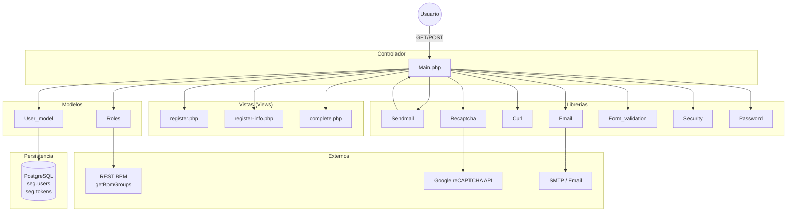
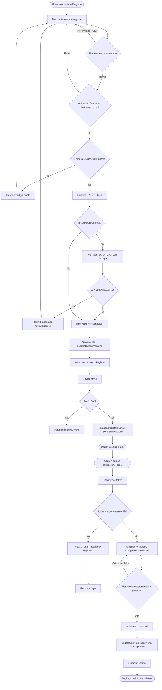
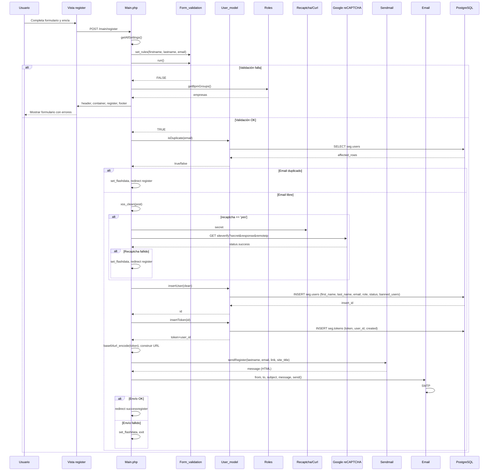
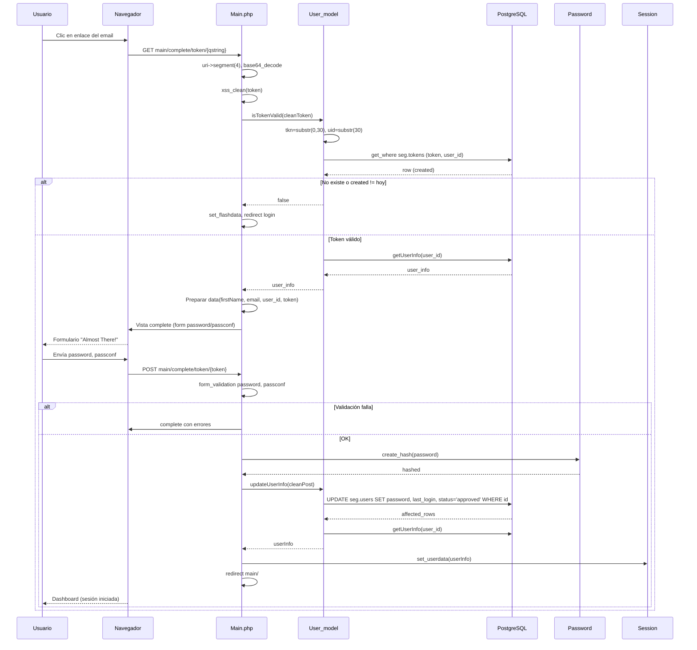
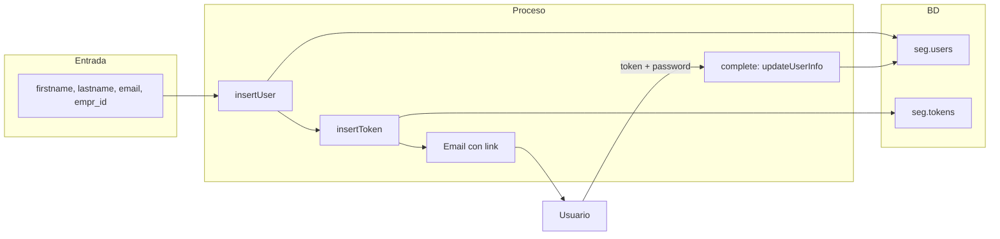

# Registración de usuarios (frontend) – Trazalog Tools

**Audiencia:** Equipo de desarrollo (perfil funcional y técnico).  
**Stack:** PHP 5, CodeIgniter 3.1.5.  
**Última actualización:** Marzo 2025.

Este documento describe el flujo actual de **registración desde el frontend** (alta de usuario por el propio usuario mediante formulario público y correo de activación). No cubre el ABM de usuarios ni la creación desde el panel de administración (ver `doc/creacion-usuarios.md`).

---

## 1. Resumen ejecutivo (vista funcional)

### 1.1 Qué hace el sistema

- Un usuario **no autenticado** puede solicitar una cuenta desde la pantalla de registro.
- Completa: **nombre**, **apellido**, **email** y **empresa** (lista que viene de BPM).
- El sistema valida que el **email tenga formato válido** (p. ej. `usuario@dominio.com`); no se comprueba si el buzón existe.
- Opcionalmente el sistema puede exigir **reCAPTCHA** (según configuración en Settings; ver sección 3.2).
- Si el email no está ya registrado, el sistema:
  - Crea un usuario en estado **pendiente** (sin contraseña).
  - Genera un **token de un solo uso** válido solo el mismo día.
  - Envía un **correo** con un enlace para “Establecer contraseña”.
- El usuario abre el enlace, define **contraseña** y **confirmación**.
- Tras guardar, el usuario queda **aprobado** y se inicia sesión automáticamente; se redirige al dashboard.

### 1.2 Dónde termina el flujo

- **Pantalla de éxito del envío:** “Email Sent Successfully” con enlace a login.
- **Pantalla de completar registro:** formulario “Almost There!” para definir contraseña.
- **Después de completar:** redirección a `main/` (dashboard) con sesión iniciada.

### 1.3 Limitaciones conocidas (para extensión futura)

- El campo **empresa** (empr_id) se muestra en el formulario pero **no se persiste** en este flujo (no se guarda en `seg.users` ni en `seg.users_business`).
- El token **expira el mismo día** (por fecha en `seg.tokens.created`); no hay ventana configurable en horas.
- No se crea usuario en BPM ni en AssetPlanner en este flujo; solo en PostgreSQL (`seg.users` + `seg.tokens`).
- Credenciales SMTP están hardcodeadas en una rama del código cuando reCAPTCHA está desactivado.
- **No hay validación por dominio de email:** el código actual no rechaza ningún dominio (p. ej. Gmail, Hotmail); solo se valida el formato del email.
- **No hay formulario dinámico de preguntas** para el usuario recién registrado; después de establecer la contraseña se redirige directamente al dashboard sin ningún paso adicional de cuestionario o preguntas.

### 1.4 Verificación del código analizado

Este documento refleja **únicamente** lo que está implementado en el código actual (revisión sobre `application/controllers/Main.php`, `application/models/User_model.php`, `application/views/register.php`, `application/views/complete.php`, `application/views/register-info.php`, y flujo de rutas relacionado).

**No encontrado en el código actual:**

- **Validación por dominio de email (p. ej. bloquear Gmail):** No existe en el flujo de registro ninguna regla ni callback que rechace dominios concretos (Gmail, Hotmail, Yahoo, etc.). La única validación sobre el email es `required|valid_email` (formato). Si en el pasado existió o se planeó una restricción por dominio, no está presente en los controladores ni en el modelo en la rama revisada.
- **Formulario dinámico con preguntas para el usuario recién registrado:** Tras completar la contraseña en `main/complete/token/...`, el sistema hace `updateUserInfo`, guarda sesión y redirige a `main/` (dashboard). No hay ningún paso intermedio que muestre un formulario dinámico ni un cuestionario de preguntas al nuevo usuario. Las únicas pantallas del flujo son: registro (nombre, apellido, email, empresa, reCAPTCHA) → éxito de envío de email → “Almost There!” (solo contraseña y confirmación) → dashboard. Si existe o existió un formulario de preguntas en otro módulo o en otra parte del flujo (p. ej. en BPM o en una pantalla posterior al primer login), no está integrado en el flujo `register` / `complete` del código revisado.

Si alguno de estos comportamientos corresponde a otra aplicación, a una versión anterior o a una funcionalidad planificada, conviene indicarlo para ajustar la documentación o el alcance de una futura extensión.

---

## 2. Arquitectura de componentes

### 2.1 Diagrama de componentes (Mermaid)

### 2.2 Responsabilidades por capa

| Capa        | Archivo / componente | Responsabilidad en registración |
|------------|----------------------|----------------------------------|
| **Controlador** | `Main.php` | Orquestar registro (`register`), éxito (`successregister`), completar con token (`complete`). Validación de formulario, decisión reCAPTCHA, envío de email, redirecciones. |
| **Modelo** | `User_model.php` | `insertUser`, `insertToken`, `isDuplicate`, `isTokenValid`, `updateUserInfo`. Acceso a `seg.users` y `seg.tokens`. |
| **Modelo** | `Roles.php` | `getBpmGroups()` para rellenar el dropdown de empresas en el formulario de registro. |
| **Vistas** | `register.php` | Formulario de registro (nombre, apellido, email, empresa, opcional reCAPTCHA). |
| **Vistas** | `register-info.php` | Mensaje “Email Sent Successfully” y enlace a login. |
| **Vistas** | `complete.php` | Formulario para establecer contraseña y confirmación (con token en URL). |
| **Librerías** | `Sendmail` | Construir cuerpo del correo de registro (`sendRegister`). |
| **Librerías** | `Email` | Enviar el correo (SMTP). |
| **Config** | `config.php` | `roles`, `status`, `banned_users`, `register` (email remitente). |

---

## 3. Flujo de actividad (registro + activación)

### 3.1 Diagrama de actividad (Mermaid)

### 3.1.1 Explicación funcional detallada del flujo (en palabras)

A continuación se describe el mismo flujo del diagrama 3.1, paso a paso, con lenguaje funcional.

1. **Entrada al registro**  
   El usuario abre la pantalla de registro (por ejemplo desde un enlace “Registrarse”). El sistema muestra el formulario con los campos nombre, apellido, email y empresa (lista obtenida de BPM). Si en la configuración del sistema (Settings) está activado reCAPTCHA, en el formulario también se muestra el widget de reCAPTCHA de Google (“No soy un robot”).

2. **Envío del formulario**  
   Cuando el usuario envía el formulario (POST), el sistema primero valida que estén completos y correctos los campos obligatorios: nombre, apellido y email. Para el email se exige además que tenga **formato válido** (p. ej. algo@dominio.algo); el sistema no comprueba si ese buzón existe realmente. Si falla alguna validación, se vuelve a mostrar el formulario con los mensajes de error correspondientes.

3. **Comprobación de email duplicado**  
   Si la validación anterior pasó, el sistema consulta si ese email ya está registrado en la base de datos. Si ya existe, se muestra un mensaje tipo “El email que intenta registrar ya existe” y se vuelve al formulario de registro, sin crear usuario ni enviar correo.

4. **Protección anti-robots (reCAPTCHA)**  
   Si el email no está duplicado, el sistema sanitiza los datos y luego mira la **configuración de reCAPTCHA** (guardada en la tabla `seg.settings`, valor `recaptcha`: "yes" o "no", configurable desde la pantalla de Settings por un administrador).  
   - **Si reCAPTCHA está en "yes":** en el formulario se habrá mostrado el widget de Google. Al enviar, el sistema envía a la API de Google el valor que el usuario obtuvo al marcar “No soy un robot” (`g-recaptcha-response`) junto con la IP del visitante y la clave secreta de reCAPTCHA. Google responde si la prueba fue superada o no. Si Google responde que no es válido (por ejemplo no se marcó el reCAPTCHA, o expiró, o hay sospecha de abuso), el sistema muestra el mensaje “Error...! Google Recaptcha UnSuccessful!” y redirige de nuevo al formulario de registro, sin crear usuario ni enviar correo.  
   - **Si reCAPTCHA está en "no":** no se hace esta comprobación y se sigue directamente al siguiente paso.

5. **Creación del usuario y del token**  
   Solo si todo lo anterior pasó (y, en su caso, reCAPTCHA fue válido), el sistema crea el usuario en la base de datos (estado “pendiente”, sin contraseña) y genera un token de un solo uso asociado a ese usuario. Luego construye la URL que el usuario deberá abrir para establecer su contraseña (enlace “complete/token/…”).

6. **Envío del correo**  
   Se arma el cuerpo del correo (mensaje de bienvenida, usuario = email, indicación de que debe abrir el enlace para establecer contraseña) y se envía al email indicado en el formulario. Si el envío falla, se muestra un mensaje de error y no se redirige. Si el envío es correcto, se redirige a la pantalla de éxito (“Email Sent Successfully”), donde se indica que revise su bandeja y se ofrece un enlace al login.

7. **Uso del enlace del correo (completar registro)**  
   Cuando el usuario hace clic en el enlace del correo, el sistema decodifica el token de la URL y comprueba que exista en la base de datos y que la fecha de creación del token sea **la del día actual** (si es de otro día, se considera expirado). Si el token no es válido o está expirado, se muestra “Token inválido o expirado…” y se redirige al login. Si es válido, se muestra el formulario “Almost There!” para que el usuario elija su contraseña y la confirmación.

8. **Establecer contraseña y activación**  
   El usuario introduce contraseña y confirmación. El sistema valida que la contraseña tenga al menos 5 caracteres y que coincida con la confirmación. Si falla, se vuelve a mostrar el formulario con errores. Si pasa, se guarda la contraseña (hasheada), se actualiza el usuario a estado “aprobado”, se registra la fecha/hora de último acceso y se inicia sesión automáticamente con esos datos. Por último se redirige al dashboard (`main/`).

---

### 3.2 Puntos de decisión (detalle)

#### Validación del formulario de registro

- **Nombre, apellido y email** son obligatorios.
- **Email “válido”:** el sistema exige que el valor del campo email tenga **formato de dirección de correo** (regla `valid_email` de CodeIgniter). Eso significa que debe parecerse a una dirección válida (p. ej. `usuario@dominio.com`, con una @ y dominio con punto). **No** se comprueba que ese buzón exista ni que se pueda recibir correo en él; solo se valida la forma del texto. Si el usuario escribe “abc” o “sin-arroba”, la validación falla; si escribe “correo@ejemplo.com”, pasa (aunque ese dominio no exista).

#### Duplicado de email

- Un solo registro por email; si el email ya existe en `seg.users`, se muestra mensaje y se vuelve al formulario sin crear usuario ni enviar correo.

#### reCAPTCHA (configuración y comportamiento)

- **Cómo activar reCAPTCHA:** Ir a la pantalla **Settings** (menú de administración), localizar el campo **Recaptcha** y seleccionar **Yes**. Asegurarse de que las credenciales de Google reCAPTCHA (site key y secret) estén configuradas en la librería Recaptcha. Una vez activado, el widget "No soy un robot" aparecerá en registro, login y recuperación de contraseña.
- **Dónde se configura:** el uso de reCAPTCHA no es fijo en código: depende del valor guardado en la tabla **`seg.settings`**, campo **`recaptcha`** (`"yes"` o `"no"`). Ese valor se obtiene con `User_model->getAllSettings()` y se puede cambiar desde la **pantalla de Settings** del sistema (menú de administración), donde hay un desplegable “Recaptcha” con opciones Yes/No.
- **Si está en "yes":**  
  - En la vista de registro se muestra el widget de Google reCAPTCHA (checkbox “No soy un robot” o desafío similar).  
  - Al enviar el formulario, el sistema **obligatoriamente** valida la respuesta con la API de Google (se envían la respuesta del widget, la IP del usuario y la clave secreta).  
  - Si Google indica que la verificación falló (usuario no completó el reCAPTCHA, expiró, o rechazo por seguridad), el sistema no crea usuario ni envía email y muestra: “Error...! Google Recaptcha UnSuccessful!” y redirige de nuevo al formulario de registro.
- **Si está en "no":** no se muestra el widget en el formulario y no se hace ninguna comprobación con Google; el flujo sigue directamente tras validar nombre, apellido, email y duplicados.
- **Resumen:** reCAPTCHA es opcional a nivel de configuración (Settings), pero cuando está activado es obligatorio superarlo para poder registrarse.

#### Token de activación

- Válido solo si existe en `seg.tokens` y la fecha `created` es la del día actual (comparación por día, no por hora). Si el usuario abre el enlace al día siguiente, el token se considera expirado.

#### Contraseña en “complete”

- Mínimo 5 caracteres y el campo de confirmación debe coincidir con la contraseña.

---

## 4. Secuencia técnica (registro y complete)

### 4.1 Secuencia: Envío del formulario de registro (POST register)

### 4.2 Secuencia: Completar registro (establecer contraseña con token)

---

## 5. Detalle por archivo (referencia técnica)

### 5.1 Controlador `Main.php`

| Método | Líneas aprox. | Descripción |
|--------|----------------|-------------|
| `register()` | 1084–1203 | GET: muestra formulario (header, container, register, footer). POST: valida, comprueba duplicado, opcional reCAPTCHA, insertUser, insertToken, arma URL, envía email, redirect successregister o flash error. |
| `successregister()` | 1205–1212 | Carga header, container, vista `register-info`, footer. |
| `complete()` | 1229–1281 | GET con token en segment(4): decodifica token, valida con `isTokenValid`, muestra formulario complete o redirect login. POST: valida password/passconf, hashea, updateUserInfo, set_userdata, redirect main/. |
| `base64url_encode()` | 1545–1547 | Codificación base64 URL-safe para el token en la URL. |

**Validación en registro:** se usa `set_rules('email', 'Email', 'required|valid_email')`. La regla `valid_email` de CodeIgniter valida solo el formato de la cadena (p. ej. que tenga @ y estructura tipo usuario@dominio); no comprueba existencia del buzón. El valor de reCAPTCHA (activar o no el widget y la verificación) se lee de `$this->user_model->getAllSettings()->recaptcha`, que a su vez viene de la tabla `seg.settings` (configurable desde la pantalla Settings del sistema).

**Rutas efectivas:**

- `main/register` → formulario y envío de registro.
- `main/successregister` → mensaje de éxito de envío de email.
- `main/complete/token/{qstring}` → establecer contraseña (GET y POST).

### 5.2 Modelo `User_model.php`

| Método | Uso en registración |
|--------|----------------------|
| `insertUser($d)` | Inserta en `seg.users`: first_name, last_name, email, role=`$config['roles'][0]` ('4'), status=`$config['status'][0]` ('pending'), banned_users=`$config['banned_users'][0]`. Devuelve `insert_id()`. |
| `isDuplicate($email)` | Consulta `seg.users` por email; retorna true si existe. |
| `insertToken($user_id)` | Genera token 30 caracteres (sha1(rand())), inserta en `seg.tokens` (token, user_id, created=today). Retorna concatenación `token . user_id` (para codificar en URL). |
| `isTokenValid($token)` | Parte token en tkn (30) y uid; busca en `seg.tokens`; si no existe retorna false; si `created` no es la fecha de hoy retorna false; sino retorna `getUserInfo(user_id)`. |
| `updateUserInfo($post)` | Actualiza `seg.users`: password (hasheado), last_login, status=`$config['status'][1]` ('approved'). Usa `$post['user_id']`. Retorna getUserInfo o false. |

### 5.3 Tablas involucradas

- **seg.users:** id, first_name, last_name, email, password (NULL hasta complete), role, status, banned_users, last_login, etc. En registro solo se rellenan los campos indicados en `insertUser`.
- **seg.tokens:** token (30 chars), user_id, created (date). Un registro por activación; la validez es “mismo día” según `created`.

### 5.4 Configuración relevante

**En `config.php`:**
- `$config['roles'] = array('4', '1');` → registro usa el primero ('4').
- `$config['status'] = array('pending', 'approved');` → registro crea 'pending', complete pasa a 'approved'.
- `$config['banned_users'] = array('unban', 'ban');` → registro usa el primero.
- `$config['register']` → email remitente del correo de registro.

**En base de datos (`seg.settings`, vía `User_model->getAllSettings()`):**
- `site_title`: título del sitio (usado en el correo de registro).
- **`recaptcha`:** `'yes'` o `'no'`. Si es `'yes'`, en el formulario de registro se muestra el widget de Google reCAPTCHA y, al enviar, se valida la respuesta con la API de Google; si es `'no'`, no se muestra el widget ni se hace esa validación. Este valor se puede cambiar desde la pantalla de Settings del sistema (administración).

### 5.5 Vista `register.php`

- Formulario con `form_open('/main/register')`.
- Campos: firstname, lastname, email, empr_id (dropdown de empresas desde `$empresas` → `Roles->getBpmGroups()`).
- Si `$recaptcha == 'yes'`: `$this->recaptcha->render()`.
- Botón “Sign up”, enlace “Registrado? Ingrese...” a main/login.

### 5.6 Vista `complete.php`

- Formulario con `form_open(site_url().'main/complete/token/'.$token)`.
- Campos: password, passconf, hidden user_id.
- Mensaje con firstName y email.
- Botón “Complete”.

### 5.7 Librería `Sendmail::sendRegister($ls, $em, $link, $tLe)`

- Parámetros: apellido, email, enlace (HTML), título del sitio.
- Genera cuerpo HTML: bienvenida, usuario = email, contraseña “(Not Set)”, instrucción de activar y establecer contraseña mediante el enlace.
- Retorna el string del mensaje (no envía; quien envía es `Email`).

---

## 6. Diagrama de flujo de datos (resumido)

- **empr_id** no se persiste en este flujo (solo se usa en vista para mostrar empresas).
- **BPM** solo aporta la lista de empresas para el dropdown; no se crea usuario en BPM en el flujo de registración.

---

## 7. Relación con otros documentos

- **Creación de usuarios (ABM):** `doc/creacion-usuarios.md` — flujo desde el panel de administración (PostgreSQL, BPM, AssetPlanner, API).
- **Estado de fases:** `doc/estado-fases-creacion-usuarios.md` — estado de la migración y pruebas del ABM.

La **registración** documentada aquí es independiente de ese flujo: solo toca `seg.users` y `seg.tokens`, y no llama a BPM ni AssetPlanner.

---

**Versión del documento:** 1.0  
**Fecha:** Marzo 2025
