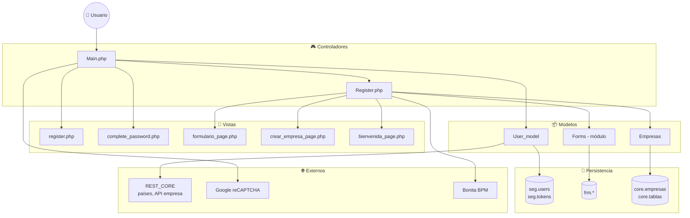
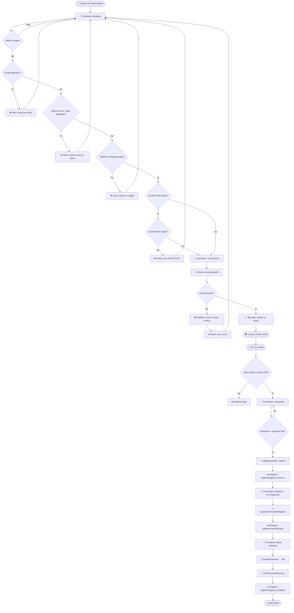
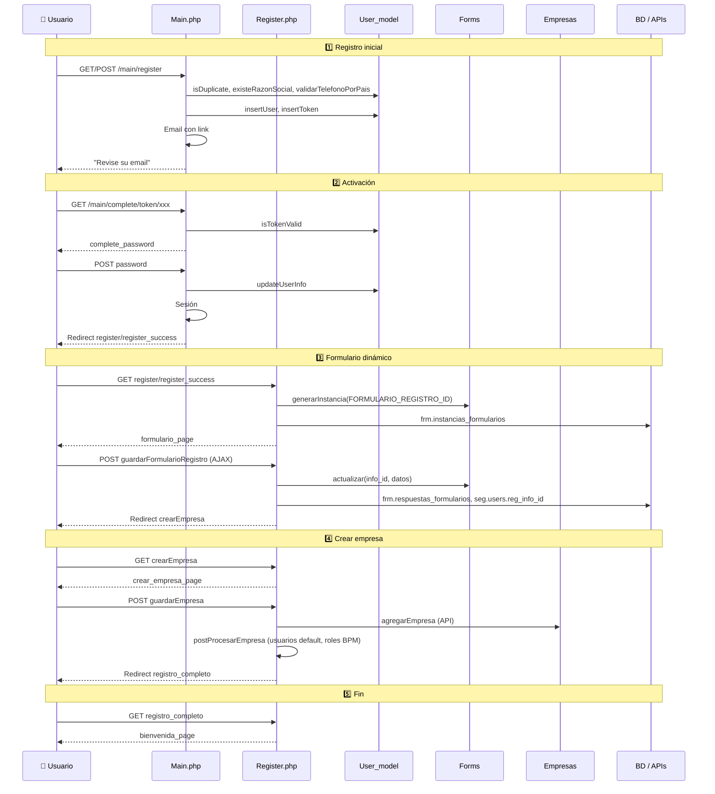

# 📋 Proceso de registración de usuarios – Trazalog Tools

**Audiencia:** Equipo de desarrollo (perfil funcional y técnico).  
**Stack:** PHP 5, CodeIgniter 3.1.5.  
**Última actualización:** Marzo 2025.

Este documento describe el **flujo completo** de registración desde el frontend (alta por el propio usuario), incluyendo formulario inicial, activación por email, **formulario dinámico con preguntas** y **creación de empresa**.  
No cubre el ABM de usuarios desde el panel de administración (ver `doc/creacion-usuarios.md`).

---

## 📌 Resumen ejecutivo

El proceso tiene **6 etapas**:

| # | Etapa | Qué hace el usuario |
|---|--------|----------------------|
| 1️⃣ | **Formulario inicial** | Completa nombre, apellido, email, razón social, teléfono y país |
| 2️⃣ | **Validaciones** | El sistema valida duplicados, formato de teléfono por país y reCAPTCHA (si está activo) |
| 3️⃣ | **Activación** | Recibe un email, hace clic en el enlace y establece su contraseña |
| 4️⃣ | **Formulario dinámico** | Completa un cuestionario con preguntas adicionales (definidas en BD) |
| 5️⃣ | **Crear empresa** | Completa datos de empresa (CUIT, provincia, localidad, etc.) y se crea la empresa vía API |
| 6️⃣ | **Bienvenida** | Ve la página de registro completado con información freemium |

---

## 🎯 Qué hace el sistema (vista funcional)

### 1️⃣ Formulario de registro inicial

- El usuario accede a **`/main/register`**.
- Completa: **nombre**, **apellido**, **email**, **razón social de la empresa**, **teléfono** y **país** (lista obtenida desde `REST_CORE/tablas/paises_registracion`).
- El sistema valida:
  - **Email:** formato válido (`valid_email`) y que **no esté ya registrado**.
  - **Razón social:** que **no exista** la misma razón social para el mismo país en `core.empresas`.
  - **Teléfono:** formato según el país (regex por país: AR, BR, CL, UY, PE, EC, MX, BO).
  - **reCAPTCHA:** si en Settings está en "yes", es obligatorio y se valida con Google.
- Si todo es correcto: se crea el usuario en `seg.users` (sin contraseña, estado `pending`), se genera un **token** en `seg.tokens`, se envía un **email** con el enlace de activación y se muestra mensaje de éxito.  
  Si falla el envío del email, se **eliminan** el usuario y el token (rollback).

### 2️⃣ Activación de la cuenta

- El usuario abre el enlace del email: **`/main/complete/token/{token}`**.
- El sistema valida que el token exista y sea del **día actual** (expiración por día).
- Se muestra el formulario **“Establecer contraseña”** (`complete_password.php`): contraseña y confirmación (mínimo 5 caracteres).
- Al guardar: se actualiza el usuario (contraseña hasheada, estado `approved`), se crea la **sesión** y se redirige a **`/register/register_success`**.

### 3️⃣ Formulario dinámico con preguntas

- En **`/register/register_success`** se crea una **instancia** del formulario de registro (ID definido por `FORMULARIO_REGISTRO_ID` en constants) y se muestra la vista **`formulario_page.php`** con el formulario generado dinámicamente desde la base de datos (módulo `traz-comp-formularios`: `frm.formularios`, `frm.items`, `core.tablas` para opciones).
- El usuario completa las preguntas (radios, checkboxes, textos, etc.) y hace clic en **Guardar**.
- Se envía por **AJAX** a **`/register/guardarFormularioRegistro`**: se guardan las respuestas en `frm.respuestas_formularios`, se actualiza `seg.users.reg_info_id` con el `info_id` de la instancia y se redirige a **`/register/crearEmpresa`**.

### 4️⃣ Crear empresa

- En **`/register/crearEmpresa`** se muestra **`crear_empresa_page.php`** con los datos del usuario (nombre, razón social, teléfono, país) y campos a completar: **CUIT**, **provincia**, **localidad**, imagen opcional, etc.
- Al enviar **`/register/guardarEmpresa`**: se valida (CUIT, provincia, localidad), se llama a la **API** para crear la empresa (`Empresas->agregarEmpresa`), y en **postProcesarEmpresa** se crean usuarios por defecto (si está configurado `REGISTRACION_USUARIOS_DEFAULT`) y se asignan roles en BPM. Luego se redirige a **`/register/registro_completo`**.

### 5️⃣ Página de bienvenida

- **`/register/registro_completo`** muestra **`bienvenida_page.php`** con el mensaje de registro completado e información de usuarios freemium.

---

## 🗂️ Dónde termina cada paso

| Paso | URL / acción | Pantalla / resultado |
|------|----------------|----------------------|
| Registro OK | `main/register` (POST) | Mensaje “Registro exitoso! Revise su email…” (mismo formulario con mensaje) |
| Token inválido | `main/complete/token/xxx` | Redirect a `main/login` con “Token inválido o expirado…” |
| Contraseña OK | `main/complete` (POST) | Redirect a `register/register_success` |
| Formulario dinámico | `register/guardarFormularioRegistro` (AJAX) | Redirect a `register/crearEmpresa` |
| Empresa creada | `register/guardarEmpresa` (POST) | Redirect a `register/registro_completo` |
| Fin | `register/registro_completo` | `bienvenida_page.php` |

---

## 🏗️ Diagrama de componentes

---

## 📊 Diagrama de actividad (flujo completo)

---

## 🔀 Diagrama de secuencia (resumido)

---

## 📁 Archivos y responsabilidades

### Controladores

| Archivo | Métodos principales | Rol |
|---------|--------------------|-----|
| **Main.php** | `register()`, `procesarRegistro()`, `complete()` | Formulario inicial, validaciones, insertUser/insertToken, email, activación con contraseña y redirect a register_success. |
| **Register.php** | `register_success()`, `guardarFormularioRegistro()`, `crearEmpresa()`, `guardarEmpresa()`, `registro_completo()` | Formulario dinámico, guardar respuestas, pantalla crear empresa, llamada API empresa, postProcesarEmpresa, bienvenida. |

### Modelos

| Modelo | Métodos en registración | Rol |
|--------|---------------------------|-----|
| **User_model** | `insertUser()`, `isDuplicate()`, `existeRazonSocial()`, `validarTelefonoPorPais()`, `insertToken()`, `isTokenValid()`, `updateUserInfo()`, `obtenerPaisesRegistracion()` | BD seg.users, seg.tokens; validaciones; países vía REST_CORE. |
| **Forms** (módulo) | `generarInstancia()`, `actualizar()` | Instancias y respuestas en `frm.*`. |
| **Empresas** | `agregarEmpresa()`, `listarPaises()`, `getEstados()`, `getLocalidades()` | API empresa y datos para crear_empresa_page. |

### Vistas

| Vista | Cuándo se muestra |
|-------|--------------------|
| **register.php** | Formulario inicial (nombre, apellido, email, razón social, teléfono, país). |
| **complete_password.php** | Tras abrir el link del email: establecer contraseña. |
| **formulario_page.php** | Tras activar: formulario dinámico con preguntas. |
| **crear_empresa_page.php** | Tras guardar formulario dinámico: datos de empresa (CUIT, provincia, localidad). |
| **bienvenida_page.php** | Tras crear empresa: registro completado. |

### Configuración

- **seg.settings:** `recaptcha` (yes/no), `site_title`, etc. (vía `getAllSettings()`).
- **config.php:** `roles`, `status`, `banned_users`, `register` (email remitente).
- **constants.php:** `FORMULARIO_REGISTRO_ID`, `REST_CORE_PAISES`, `REGISTRACION_USUARIOS_DEFAULT`, `API_CORE`, etc.

---

## ✅ Validaciones (resumen)

| Validación | Dónde | Mensaje / acción |
|------------|--------|-------------------|
| **Email formato** | CodeIgniter `valid_email` | Solo formato; no se comprueba si el buzón existe. |
| **Email duplicado** | `User_model->isDuplicate()` en `seg.users` | "El email que intenta registrar ya existe...". |
| **Razón social duplicada** | `User_model->existeRazonSocial()` en `core.empresas` por país | "La Razón Social ingresada ya existe en el sistema para el país solicitado". |
| **Teléfono por país** | `User_model->validarTelefonoPorPais()` (regex por país) | "El formato del teléfono no es válido para el país seleccionado.". |
| **reCAPTCHA** | Si `seg.settings.recaptcha = yes`, validación con Google | "Error en la validación reCAPTCHA. Intente nuevamente.". |
| **Token** | Mismo día en `seg.tokens.created` | "Token inválido o expirado…" → redirect login. |
| **Contraseña** | min_length 5, passconf matches | Errores en formulario complete_password. |

---

## 💾 Tablas y datos clave

- **seg.users:** id, first_name, last_name, email, password (null hasta activación), role, status, banned_users, **reg_pais_id**, **reg_razon_social**, telefono, **reg_info_id** (tras formulario dinámico).
- **seg.tokens:** token (30 chars), user_id, created (fecha día).
- **frm.instancias_formularios:** info_id, form_id, fecha_creacion.
- **frm.respuestas_formularios:** info_id, item_id, valor.
- **core.empresas**, **core.tablas:** razón social, países, etc.

---

## 🔗 Relación con otros documentos

- **doc/creacion-usuarios.md:** Creación de usuarios desde el ABM (PostgreSQL, BPM, AssetPlanner, API).
- **doc/PROCESO_REGISTRACION.md:** Descripción detallada del mismo flujo con más diagramas de secuencia.
- **doc/FORMULARIOS_DINAMICOS.md:** Uso del módulo `traz-comp-formularios` (instancias, respuestas, helpers).

---

**Versión:** 1.0 · **Fecha:** Marzo 2025 · Generado a partir del código actual (Main, Register, User_model, vistas y módulo de formularios).
